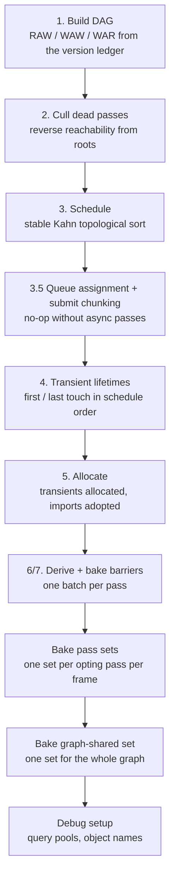

## Frame Graph Design and Usage Documentation
---
### Overview

The **FrameGraph** is a compiled **D**irected **A**cyclic **G**raph (**DAG**) designed to address the complex problem of synchronisation with vulkan between
distinct GPU passes, the graph consists of **GraphPass**'s each which primarily declare a Setup method which defines what resources the pass requires, and an Execute
method which declares the code the pass will run during graph execution, this structure of pass usage and passes thus forms the graph structure, with usage
representing edges and passes nodes.
Key synchronisation concerns include:

- Automatic derivation of Image and Buffer memory barriers based on resource usage
- And timeline semaphores to ensure safe cross queue(sync + async) compute work with resources

Another responsibility of the **FrameGraph** is to automate the creation of descriptors for graph resources, these exist at 2 distinct levels,
the graph shared set - bound by all passes within the graph(always at set index 2), and pass sets - containing the resources bound by a specific pass(always at set index 1).
The graph owns the responsibility for creating the descriptor pool and descriptor sets and then writing resources into descriptor sets, it is the
responsibility of the graph owner to specify and provide the descriptor set layout for both pass and graph shared sets.

Everything the graph decides is decided **once**, in `Compile()`. Barriers, schedule order, queue
assignment, submit batching, descriptor writes and transient allocation are all frozen into arrays
on the passes. `Execute()` replays those arrays: no analysis, no allocation, no dictionary lookups
per frame. A resize or a pipeline rebuild throws the whole graph away and compiles a new one.

---
### Contents

1. [Vocabulary](#vocabulary)
2. [Lifecycle](#lifecycle)
3. [**GraphPass** usage and documentation](#graphpass-usage-and-documentation)
4. [Resources](#resources)
5. [Resource usage table](#resource-usage-table)
6. [Versioning: how edges are formed](#versioning-how-edges-are-formed)
7. [Compilation](#compilation)
8. [Synchronisation](#synchronisation)
9. [Async compute and submit chunks](#async-compute-and-submit-chunks)
10. [Graph-owned descriptor sets](#graph-owned-descriptor-sets)
11. [Modules and scopes](#modules-and-scopes)
12. [Execution](#execution)
13. [Debugging](#debugging)
14. [Authoring rules](#authoring-rules)
15. [Current limits](#current-limits)

---
### Vocabulary

| Term | File | What it is |
|---|---|---|
| `FrameGraph` | `FrameGraph.cs` | The graph itself: registry, compiler, executor, descriptor owner. One per technique. |
| `GraphPass` | `GraphPass.cs` | One node. Name, type, queue, declared accesses, baked barriers, execute delegate. Internal. |
| `GraphImage` / `GraphBuffer` | `GraphResources.cs` | A `(resourceId, version)` handle. Value type, cheap, and the version is what forms edges. |
| `GraphResource` | `GraphResources.cs` | The registry entry behind a handle: desc, residency, producer ledger, physical handles. Internal. |
| `ResourceUsage` | `ResourceUsage.cs` | How a pass touches a resource. The only sync input the author writes. |
| `IGraphBuilder` / `GraphBuilder` | `GraphBuilder.cs` | The per-pass authoring surface: `Read`, `Write`, `UsePassSet`. |
| `GraphScope` | `GraphScope.cs` | The graph-scope authoring surface: `CreateImage`, `ImportBuffer`, `AddPass`, plus a name prefix. |
| `IGraphModule<TIn,TOut>` | `IGraphModule.cs` | A composable chunk of graph. Appends its passes into a scope, returns output handles. |
| `QueuePlan` / `QueueClass` | `QueuePlan.cs` | The device's queue families, resolved once, and the queue a pass declares. |
| `GraphDebug` | `GraphDebug.cs` | Timestamp + pipeline-statistics query pools, debug-utils labels, object naming. Internal. |
| `PassResources` | `GraphPass.cs` | Handed to a pass body at record time: resolves handles to `VkImageView` / `VkBuffer`, carries the baked pass set. |

---
### Lifecycle

A graph is built, compiled once, executed every frame, and disposed when its inputs change shape.
`Compile()` throws if called twice, so a rebuild always means a fresh `FrameGraph`.

```csharp
private void BuildGraph()
{
    _graph?.Dispose();                       // frees transients, chunk pools, descriptor pools
    var fg = new DeferredGraph(_gpu.Gfx);

    var module = new DeferredModule(/* pipelines */);
    module.Build(fg.RootScope().Child("Deferred"),
        new DeferredModule.Inputs(_scene.GetRenderablesBuffers(), _targets.FinalColor, _targets.Extent),
        out var o);

    fg.MarkOutput(o.Final);                  // seeds the cull; without a root every pass dies
    fg.Compile();
    _graph = fg;
}

public void Render(in RenderFrame frame)
{
    // per-frame CPU packing here, then:
    _graph!.Execute(frame.Cmd, frame.View);
}
```

`BuildGraph` runs on resize (fresh extent means fresh transients) and on any rebuild that
invalidates a descriptor set layout the graph baked against. The caller guarantees the device is
idle before `Dispose`: graphs are torn down under `DeviceWaitIdle` on resize and mode switch.

`MarkOutput` is not optional. Culling seeds from three root conditions - a pass writes an imported
resource, a pass writes a `MarkOutput`'d resource, or a pass declares `hasSideEffects: true`. A
graph with no roots compiles to zero passes and renders nothing.

---
### **GraphPass** Usage and Documentation

Passes contain a few key elements:
- A PassType Where Pass type is either
  - A Graphics Pass
  - A Compute Pass
  - A RayTraced Pass
  - Or a Transfer Pass(Strictly Gpu memory management)
- PassSetup where resource relationships are declared, Including pass set usage, resource usage read and/or writes, describing the action undertaken with the resource
- PassExecute declares the code that will be executed by the FrameGraph during execution for that pass.

  An example block of code that declares a new pass could look like the following

    ```csharp
    scope.AddPass("examplePassName", PassType.Compute, QueueClass.Graphics,
            b =>
            {
                b.UsePassSet(_examplePass.PassSet);
                b.Read(readBuffer0, ResourceUsage.StorageReadCompute, "readBuffer0");
                graphBuffer0 = b.Write(writeBuffer0, ResourceUsage.StorageWriteCompute, "writeBuffer0");
                graphBuffer1 = b.Write(writeBuffer1, ResourceUsage.StorageWriteCompute, "writeBuffer1");
                graphBuffer2 = b.Write(writeBuffer2, ResourceUsage.StorageWriteCompute, "writeBuffer2");
            },
            (CommandBuffer cmd, PassResources res, in RenderView f) =>
                _example.Record(cmd, f.FrameIndex, f.Camera, res.PassSet));
    ```

The full `AddPass` signature:

```csharp
void AddPass(string name, PassType type, QueueClass queue,
             PassSetup setup, PassExecute execute,
             bool preferAsync = false, bool hasSideEffects = false);
```

| Parameter | Meaning |
|---|---|
| `name` | Leaf name. The scope prefix is prepended, so a pass authored in `scope.Child("Deferred")` becomes `Deferred/CullPass`. Shows in ToDot, RenderDoc labels and the stats panel. |
| `type` | Drives the debug label colour, pipeline-statistics eligibility, and the async-queue legality check. It does **not** pick the barrier stages - `ResourceUsage` does that. |
| `queue` | `Graphics`, `AsyncCompute` or `Transfer`. `AsyncCompute` collapses to `Graphics` when the device has no dedicated compute family. |
| `setup` | Runs immediately, inside `AddPass`. Declares accesses and opts into a pass set. Never records commands. |
| `execute` | Runs per frame during `Execute`, after the pass's baked barrier batch has been emitted. |
| `preferAsync` | Stored on the pass, read by nothing. A placeholder for a future scheduler that promotes passes to the async queue on its own. Declare `QueueClass.AsyncCompute` to get the async queue. |
| `hasSideEffects` | Keeps the pass alive through culling even when nothing consumes its writes. Use for passes whose observable output leaves the graph by some other route (a readback, a query, a resource the host reads directly). |

`setup` runs eagerly, which is why the pattern is capture-and-reassign: the lambda mutates handles
declared in the enclosing `Build` method, and the next pass reads the reassigned handle.

---
### Resources

Two residencies, chosen by which method declares the resource.

**Transient** - the graph owns it. `CreateImage` / `CreateBuffer` register a virtual resource; step
5 of `Compile` allocates real memory for it, and `Dispose` frees it. Transient images are allocated
at `GpuMemoryAllocator.PriorityHigh` (g-buffers, depth and HDR targets are touched every frame, so
they stay resident ahead of cold resources under WDDM budget pressure). A transient nothing live
touches is never allocated at all.

```csharp
var hdr = scope.CreateImage(new ImageDesc
{
    Format = Format.R16G16B16A16Sfloat, Extent = ext, Mips = 1, Layers = 1,
    Usage  = ImageUsageFlags.ColorAttachmentBit | ImageUsageFlags.SampledBit,
}, "HDRColor");
```

**Imported** - somebody else owns it. The graph adopts the handle, derives barriers for it, and
never allocates or frees it.

| Method | Use for |
|---|---|
| `ImportImage(image, view, desc, currentLayout, name, finalLayout = null)` | A host-owned target the graph writes and the host consumes afterwards (FinalColor). `currentLayout` is what it arrives in each frame; `finalLayout` is what the graph guarantees on exit. |
| `ImportBuffer(buffer, desc, name)` | A single pipeline-owned buffer (ReSTIR reservoirs, the PT G-buffer). Importing it makes the graph order this frame's access against the previous frame's write to the same memory. |
| `ImportBufferPerFrame(perFrame, desc, name)` | A double-buffered resource, one handle per frame-in-flight, indexed by `RenderView.FrameIndex`. Barriers are baked once and the `.Buffer` field is patched per frame at Execute. |

An imported image's layout contract is the part that bites. The first-use barrier is baked assuming
`currentLayout`, so a resource that arrives in some other layout gets the wrong barrier.
`finalLayout` closes the loop: after the last pass, the graph emits a closing barrier batch
restoring every imported image to its declared final layout, which keeps next frame's baked
first-use barrier valid. `finalLayout` of `Undefined` means "no restore" - correct for a target
whose contents are fully rewritten each frame.

`ImportBufferPerFrame` resources cannot be resolved through `PassResources.Buffer` (which frame
would it pick?). It throws with that message. Read the handle from the owning pipeline inside the
pass body instead, using `f.FrameIndex`.

---
### Resource usage table

`ResourceUsage` is the single sync input. `UsageTable.Of` maps it to a stage mask, an access mask,
an image layout and a write flag, and every barrier the graph emits is built from two of these
entries: the resource's current state and the state the next access wants.

| Usage | Stage | Access | Layout | Write |
|---|---|---|---|---|
| `ColorAttachment` | ColorAttachmentOutput | ColorAttachmentRead\|Write | ColorAttachmentOptimal | yes |
| `DepthAttachment` | Early\|LateFragmentTests | DepthStencilAttachmentRead\|Write | DepthStencilAttachmentOptimal | yes |
| `DepthRead` | EarlyFragmentTests\|FragmentShader | DepthStencilAttachmentRead | DepthStencilReadOnlyOptimal | no |
| `SampledFragment` | FragmentShader | ShaderSampledRead | ShaderReadOnlyOptimal | no |
| `SampledCompute` | ComputeShader | ShaderSampledRead | ShaderReadOnlyOptimal | no |
| `StorageReadCompute` | ComputeShader | ShaderStorageRead | General | no |
| `StorageWriteCompute` | ComputeShader | ShaderStorageWrite | General | yes |
| `StorageRWCompute` | ComputeShader | ShaderStorageRead\|Write | General | yes |
| `StorageReadVertex` | VertexShader | ShaderStorageRead | General | no |
| `StorageReadFragment` | FragmentShader | ShaderStorageRead | General | no |
| `IndirectArg` | DrawIndirect | IndirectCommandRead | - | no |
| `IndirectArgStorageRead` | DrawIndirect\|ComputeShader | IndirectCommandRead\|ShaderStorageRead | - | no |
| `TransferSrc` | AllTransfer | TransferRead | TransferSrcOptimal | no |
| `TransferDst` | AllTransfer | TransferWrite | TransferDstOptimal | yes |
| `StorageRT` | RayTracingShader | ShaderStorageRead\|Write | General | yes |
| `AccelStructBuild` | AccelerationStructureBuild | AccelerationStructureWrite | - | no |
| `AccelStructRead` | RayTracingShader\|Compute\|Fragment | AccelerationStructureRead | - | no |
| `StorageConcurrentCompute` | ComputeShader | ShaderStorageRead\|Write | General | yes (concurrent) |
| `Present` | BottomOfPipe | none | PresentSrcKhr | no |
| `IndexBuffer`, `VertexBuffer`, `UniformRead` | - | - | - | - |

Three of these carry rules beyond the mapping:

**`StorageConcurrentCompute`** declares that the accessors are mutually safe by construction -
disjoint element sets, or commutative updates the author has reasoned about. Two consecutive
accesses with this usage derive **no barrier**, exactly like read-after-read, so the later pass can
overlap the earlier one on the queue. A barrier is still emitted on the transition into and out of
the concurrent run, so visibility against ordinary readers and writers is intact. Versions still
bump, so the DAG and the schedule are unchanged; only the barrier relaxes. The wavefront path
tracer uses it for the NEE accumulator on the single-queue fallback path.

**`IndirectArgStorageRead`** is for a buffer consumed as both the indirect-dispatch source and a
compute storage read in the same pass (dispatch words plus a trailing count the kernel reads).
Declaring that as two separate reads would bake the barrier from the first and leave the second
unpublished, so it is one usage whose destination scope covers both access kinds.

**`IndexBuffer`, `VertexBuffer`, `UniformRead`** map to a default `UsageInfo`: zero stage, zero
access, `Undefined` layout. They emit a barrier with empty scopes, which synchronises nothing.
Nothing in the engine declares them today. Fill in the table entry before using one.

---
### Versioning: how edges are formed

There are no declaration-order dependencies and no manual edges. Every edge comes from the version
ledger.

Each `GraphResource` holds `Producers`, a list where `Producers[v]` is the pass index that produced
version `v`. It starts as `{ -1 }`: version 0 exists with no producer, which is the sentinel for
"fresh transient or imported value". `Write` appends to that list and hands back a handle at the new
version. `Read` records the version of the handle it was given.

```csharp
var a = b.Write(hdr, ResourceUsage.ColorAttachment);   // hdr@0 -> hdr@1, this pass produces v1
b.Read(a, ResourceUsage.SampledFragment);              // reads v1 -> RAW edge to the writer
```

From that ledger `Compile` derives three edge kinds:

- **RAW** - a read of `(res, v)` edges from `Producers[v]` to the reader.
- **WAW** - a write producing `(res, v)` edges from `Producers[v-1]` to the writer.
- **WAR** - a write producing `(res, v)` edges from every reader of `v-1` to the writer.

Edges into a `-1` producer are dropped (nothing produced the initial version). Edges are deduped
through a `HashSet`, because a duplicate would double-count the in-degree and strand the topological
sort into a false cycle report.

The consequence for authors: **always assign the handle `Write` returns**. `Write` bumps the ledger
whether or not you keep the result, but a later `Read` of the stale handle reads the older version
and orders against the older producer. That is a silent wrong-ordering bug, not an error.

---
### Compilation



**1. DAG.** As above. Edge labels are captured alongside for `ToDot`.

**2. Cull.** Roots are passes that write an imported resource, write a `MarkOutput`'d resource, or
declare `hasSideEffects`. Everything reachable backwards from a root through the predecessor map is
live; the rest is dropped along with any transient only it touched. Culled passes are kept in the
list (greyed out in `ToDot`) and counted in `GraphStats.CulledPassCount`.

**3. Schedule.** Kahn's algorithm over the live subgraph only, with a `SortedSet` ready queue so the
lowest ready pass id always goes next. That makes the order deterministic frame to frame and capture
to capture. If the emitted order is shorter than the live count, a cycle exists among live passes and
`Compile` throws.

**3.5 Chunking.** See [async compute](#async-compute-and-submit-chunks). A no-op unless a live pass
landed on a real async queue.

**4. Lifetimes.** First and last schedule index that touches each resource. Computed here so the
schedule stays the single source of ordering truth; consumed by memory aliasing, which is not
implemented yet.

**5. Allocate.** Transients touched by a live pass get device-local memory and, for images, a view.
Imports already carry their handles. `LastUse < 0` means nothing live touched it, so it is skipped.

**6/7. Sync.** Barrier derivation, below. The result - the schedule, the per-pass barrier arrays and
the resolved physical handles - is the frozen plan.

Compile cost lands in `GraphStats.CompileMs`.

---
### Synchronisation

`BakeSync` walks the schedule holding one `UsageInfo` cursor per resource: the stage, access and
layout the last access left it in. Transients seed at `TopOfPipe` / no access / `Undefined` (fresh
memory, contents are garbage). Imports seed at `AllCommands` / `MemoryRead|MemoryWrite` /
`InitialLayout`, which is conservative and correct for a resource somebody else just wrote.

For each access the graph compares the cursor against the incoming usage:

- **Read after read, compatible layout** - no barrier. The cursor's stage and access masks are
  *widened* with the new ones, so the eventual writer waits on every prior reader rather than only
  the last. Two readers on different stages would otherwise drop the first.
- **Concurrent after concurrent** - no barrier, same widening, for the reasons under
  `StorageConcurrentCompute` above.
- **Anything else** - one barrier, from the cursor's state to the new usage's state. Images get an
  `ImageMemoryBarrier2` covering all mips and layers, with the aspect mask picked from the format.
  Buffers get a `BufferMemoryBarrier2` over the whole size, plus a parallel record of which resource
  it targets so `Execute` can patch per-frame handles into it.

Every barrier a pass needs is collected into one batch and emitted as a single `CmdPipelineBarrier2`
immediately before the pass body. A pass whose inputs are already in the right state emits nothing.

After the last pass, the closing batch restores imported images to their declared `finalLayout`.
That is what makes the baked first-use barriers valid on the *next* frame, and what leaves
FinalColor in `ShaderReadOnlyOptimal` for the host's blit and ImGui sampler.

Cross-queue accesses derive no barrier at all. The timeline semaphore signal and wait that the same
DAG edge produced *is* the dependency: the signal makes writes available, the wait makes them
visible. A cross-queue read leaves the state cursor untouched (its execution is tracked by the
semaphore, so later consumers on the writer's own queue still derive against the real write); a
cross-queue write adopts the resource, moving both the state and the owning queue.

---
### Async compute and submit chunks

When a pass declares `QueueClass.AsyncCompute` **and** `QueuePlan` found a dedicated compute family,
the graph partitions the schedule into **submit chunks**: contiguous runs of same-queue passes, split
exactly where a cross-queue edge needs a signal or a wait.

`QueuePlan.Resolve` treats the device's compute family as async-capable only when its family index
differs from the graphics family. `GraphicsDevice.FindQueueFamilies` falls back to the graphics
family when no dedicated compute family exists, so the same-handle guard turns that fallback into
`AsyncCompute = null`. Modules branch on `GraphScope.AsyncComputeAvailable` to pick between an async
layout and a single-queue one, which is how the wavefront tracer chooses between real overlap and
the `StorageConcurrentCompute` barrier-omission fallback.

Chunking rules:

- A graphics pass with an async producer starts a **new** chunk whose submit waits on that producer's
  timeline value. A wait gates the whole submit, so passes that must not wait stay in the earlier chunk.
- A graphics pass with an async consumer **closes** its chunk with a signal, so the consumer has a
  value to wait on.
- Every async pass is its own chunk and always signals.
- Waits merge per queue at the maximum value, since a timeline wait at V covers everything below V.

Two timeline semaphores (one per queue) carry monotonic cursors across frames; the baked signal and
wait values are relative, and each `Execute` maps them onto the cursors.

The v1 restrictions are checked at compile and throw:

- An async pass must be `PassType.Compute` or `Transfer`. Graphics and `RayTrace` (`CmdTraceRays`)
  both need the graphics queue, and a dedicated compute family advertises neither.
- An async pass may touch **buffers only**. Image layouts are tracked on the graphics timeline;
  letting an async pass transition one would need queue-family ownership transfer.

Submission changes shape in this mode, and the host has to cooperate:

```csharp
if (ActiveGraphCore is { HasPendingGfxChunks: true } graphCore)
    graphCore.SubmitGfxChunks(gfx.GraphicsQueue, imgAvailWait, renderDoneSignal, graphicsCmds, inFlightFence);
else
    /* the host's own single QueueSubmit2 */;
```

`Execute` records every chunk into graph-owned command buffers and submits the **async** ones itself.
The graphics chunks are left pending, and the host's command buffer receives nothing from the graph.
`SubmitGfxChunks` then submits the graphics chunks plus the host's command buffer in one
`vkQueueSubmit2`: each chunk keeps its timeline waits and signals, and the host cmd goes last with
the binary frame-pacing semaphores and the frame fence. One submission keeps every graph pass
visible in Nsight's timeline next to the blit and UI work.

---
### Graph-owned descriptor sets

Two mechanisms, both opt-in, both owned by the graph because their lifetime *is* the graph's:
allocated at `Compile` (which runs under device-idle) and freed with their pools in `Dispose`.

**Pass sets (set 1)** - one set per opting pass per frame-in-flight, filled from that pass's named
accesses. The pipeline supplies a `PassSetSpec` (set index, reflection-built layout, reflected
binding list); the graph matches each `Read`/`Write` bind name against `BindingDesc.Name` and writes
the resolved handle.

```csharp
// Pipeline side: the layout and the names both come from the shader's set-1 declarations.
public PassSetSpec PassSet =>
    new(ShaderSets.Pass, DescriptorSetLayouts[ShaderSets.Pass], ReflectedBindings(ShaderSets.Pass));

// Module side: name the accesses, get the set back at record time.
b.UsePassSet(_lightCull.PassSet);
tileCount = b.Write(tileCount, ResourceUsage.StorageWriteCompute, "tileLightCount");
// ...
(CommandBuffer cmd, PassResources res, in RenderView f) =>
    _lightCull.Record(cmd, f, lightCount, tileCountX, tileCountY, res.PassSet)
```

The bind name is the shader global's name, so the descriptor and the barrier can never disagree
about a resource: both come from the same declaration. The image layout written into the descriptor
is taken from the same `UsageTable` entry that baked the barrier, so those cannot drift either. A
`CombinedImageSampler` binding takes its sampler from the layout's immutable sampler, which is why
the graph never has to own or plumb one.

Sets are written once at Compile and never mutated in flight. A resize rebuilds the whole graph, so
there is no per-frame rewrite; `Execute` only hands the pass body the right frame's set.

An access with no bind name is sync-only: the pass binds that resource itself, or it is an
attachment, an indirect-arg source, or lives on the scene set. Mixing is normal - `GeometryPass`
names nothing, `LightingPass` names seven.

Two authoring errors throw inside `AddPass`, before anything is compiled:

- naming a bind without calling `UsePassSet`
- naming a bind the spec has no parameter for (the message lists the known names)

**Graph-shared set (set 2)** - one set for the whole graph, shared by every pass. It fits a technique
whose passes all touch the same working buffers: the wavefront tracer's SoA arrays, the ReSTIR
reservoirs. The pipeline still owns the buffers and the layout; the graph allocates, writes and owns
the set, then hands it back through `FrameGraph.GraphSharedSet` after Compile, and the core passes
it to the pipeline for its record-time binds.

```csharp
scope.UseGraphSharedSet(_pipe.GraphSharedSpec);   // module, at Build
// after Compile:
_pipe.SetGraphSharedSet(fg.GraphSharedSet);
```

Unlike pass sets it is self-contained - the handles come straight from the spec rather than from
named accesses - and it is a single instance, not one per frame, because the handles never change in
flight and the contents are ordered by the passes' declared barriers. Buffers only, in v1.

---
### Modules and scopes

`GraphScope` is the graph-scope authoring surface: a `FrameGraph` plus a name prefix. It forwards
resource creation and `AddPass` with the prefix applied, so a module's resources and passes are
namespaced (`Deferred/HDRColor`, `Deferred/Tonemap/TonemapPass`). `Child` nests, and the top level
is `FrameGraph.RootScope()` with an empty prefix.

**Flatten, not nest.** A scope appends straight into the one graph registry. There is no separately
compiled subgraph, so the compiler keeps a global view for culling, sync and (eventually) aliasing.
The seam between two modules is an ordinary read of a handle, which means its barrier is derived like
any other and nothing has to be hand-stitched at the boundary.

An `IGraphModule<TInputs, TOutputs>` is the packaging: `Build` appends passes into the scope it is
given, wiring declared inputs to existing handles and producing output handles. Instantiate the same
module twice under distinct child names and its resources will not collide.

Shared handles must stay the same graph resource. Passing an already-imported image as a
`GraphImage` input keeps the version chain intact; re-importing the same physical image mints a
second id, and the read-after-write dependency between the two modules disappears with no error.

Wire-time port checks catch the rest:

```csharp
var hdr = scope.ExpectImage(inputs.SceneColorHdr, _hdrFormat, ImageUsageFlags.SampledBit);
var buf = scope.ExpectBuffer(inputs.Args, BufferUsageFlags.IndirectBufferBit);
```

Both throw at build time on a type, format or usage mismatch, and return the handle so calls chain.
Extent is not checked, since imported targets may omit it.

---
### Execution

```csharp
public void Execute(CommandBuffer cmd, in RenderView frame)
```

Per scheduled pass: patch per-frame buffer handles into the baked buffer barriers, open the debug
label and timestamp, emit the barrier batch, run the pass body, close the label. Then the closing
image barriers. Nothing else happens - no analysis, no allocation.

The pass body receives:

| Parameter | What it carries |
|---|---|
| `CommandBuffer cmd` | The buffer to record into. In chunked mode this is a graph-owned buffer, not the host's. |
| `PassResources res` | `View(h)` / `Image(h)` / `Buffer(h)` resolve handles to physical objects; `PassSet` is this frame's baked set, or the default handle if the pass never opted in. |
| `in RenderView f` | The immutable per-frame snapshot: frame index, camera, scene, extent, counts. |

The pass body should stay a thin call into a pipeline's `Record`. Anything that has to happen before
the graph runs (CPU packing, dispatch dimensions, uniform staging) belongs in the core's `Render`,
with the result stashed for the body to read. `DeferredCore` does exactly that for the light-cull
dispatch dimensions.

---
### Debugging

`GraphDebug` attaches at Compile and degrades to a no-op wherever the device lacks support.

- **Per-pass GPU timings.** Two timestamps per pass per frame-in-flight, resolved a frame late so
  nothing stalls. Wall-clock graph time is last-pass-end minus first-pass-begin, not the sum of the
  per-pass deltas, which would overcount because passes on one queue pipeline and overlap.
- **Pipeline statistics.** Vertex invocations, clipping invocations, fragment invocations, compute
  invocations, per eligible pass. Draw and dispatch passes only, and never on the async queue, whose
  family cannot begin a graphics-counter query. Toggle with `FrameGraph.CollectPipelineStats`.
- **Debug labels and object names.** Each pass body is wrapped in a `CmdBeginDebugUtilsLabel` region
  coloured by pass type, and every graph image, view and buffer is named, so a RenderDoc capture
  reads `GBuffer_Position` rather than a raw handle.
- **`GraphStats`** feeds the ImGui render-graph panel: frame GPU ms, compile ms, live and culled pass
  counts, total barrier count, and the per-pass timing array in schedule order.

`ToDot()` dumps the compiled DAG as Graphviz. Passes are nodes, filled by queue and prefixed with
their schedule index; culled passes are greyed. Module scopes become nested `subgraph cluster_*`
boxes. Solid edges are RAW data dependencies labelled `resource@version usage`; dashed edges are
WAW/WAR ordering dependencies; cross-module edges are drawn thicker and blue. Two boundary nodes sit
outside every cluster: `INPUTS` (dotted edges to the first pass touching each imported resource) and
`OUTPUTS` (dotted edges from the last writer of each marked output). Cores expose it through
`IGraphCore.ToDot`, and the stats panel has a Copy DOT button.

---
### Authoring rules

- Assign every handle `Write` returns. A stale handle reads an older version and orders against an
  older producer, with no error.
- Call `MarkOutput` on whatever leaves the graph before you compile. No roots means no passes.
- Declare the usage that matches what the shader does. `ResourceUsage` is the only sync input; a
  wrong entry produces a wrong barrier, and the validation layer will not always catch it.
- Declare an access for every resource a pass touches, even one the pass binds itself. An undeclared
  access is an underived barrier.
- Import a shared resource once. A second import of the same physical handle is a second id and a
  broken dependency.
- Match the import's `currentLayout` to the layout the resource arrives in each frame, and set
  `finalLayout` when anything outside the graph reads it.
- Keep the pass body thin. Per-frame CPU work belongs in the core's `Render`, before `Execute`.
- Rebuild the graph, do not mutate it. `Compile` is once per instance; resize and layout-invalidating
  rebuilds dispose and rebuild.
- Dispose under device idle, and dispose the graph before the pipelines its passes record with.

Errors that throw at authoring or compile time, rather than corrupting a frame:

| Message | Cause |
|---|---|
| `names a pass-set binding but never called UsePassSet` | A named `Read`/`Write` with no `UsePassSet` in the same setup. |
| `binds 'X' but its pass set has no such parameter` | Bind name does not match any reflected binding. |
| `cycle detected among live passes` | The version ledger produced a back-edge. |
| `PassType.X but declared QueueClass.AsyncCompute` | Only compute and transfer passes may ride the async queue. |
| `async pass 'X' accesses image 'Y'` | Async passes may touch buffers only, in v1. |
| `port mismatch on 'X'` | `ExpectImage` / `ExpectBuffer` format, type or usage check failed. |
| `buffer 'X' is per-frame` | `PassResources.Buffer` on an `ImportBufferPerFrame` resource. |

---
### Current limits

- **No memory aliasing.** Lifetimes are computed at step 4 and stored on each resource; nothing
  consumes them yet. Every transient holds its own allocation for the life of the graph.
- **No queue-family ownership transfer.** All barriers use `QueueFamilyIgnored`, which is why async
  passes are restricted to buffers.
- **The transfer queue is resolved but unused.** `QueuePlan.Transfer` finds the DMA engine;
  no pass is scheduled onto it.
- **`preferAsync` does nothing.** The scheduler never promotes a pass on its own; declare the queue.
- **One async chunk per async pass.** Consecutive async passes are not merged into a single submit.
- **The graph-shared set is buffers only.** Images would need the image-info path adding to
  `BakeGraphSharedSet`.
- **`IndexBuffer`, `VertexBuffer` and `UniformRead` have no usage-table entries.** They emit empty
  barriers.
- **Pass sets bind one descriptor per binding.** Descriptor arrays and variable-count bindings are
  not handled by the graph's writer.
