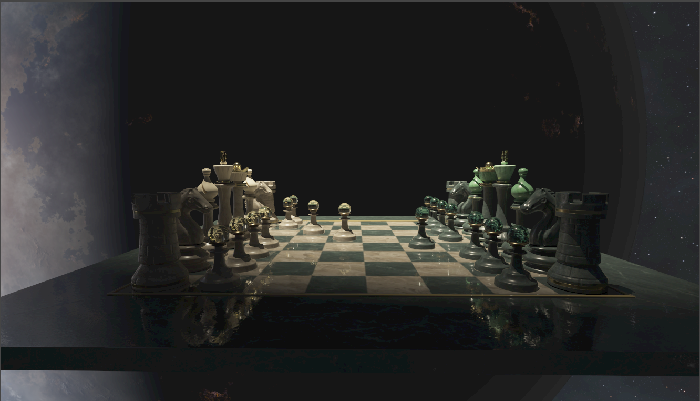
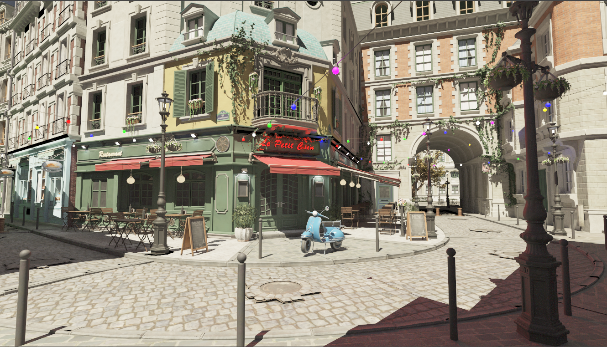
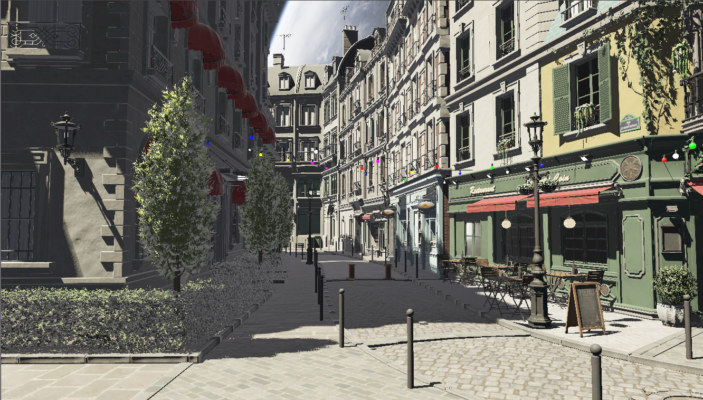
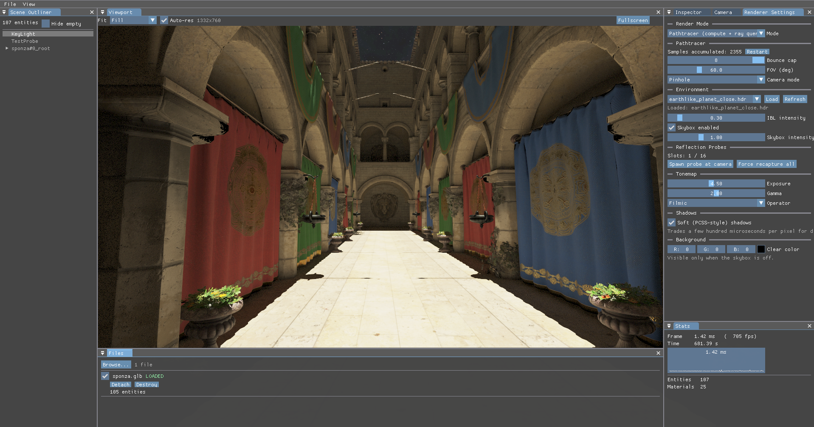

# CadThingo

A Vulkan-based 3D CAD renderer and engine written in C# (.NET 10). Built from scratch on top of [Silk.NET](https://github.com/dotnet/Silk.NET), it features a physically-based deferred renderer, image-based lighting, reflection probes, a compute path tracer, and an ImGui-driven editor.

<!-- HERO IMAGE: a nice wide screenshot of the renderer (Sponza / DamagedHelmet, etc.) -->


---

## Features

- **Deferred PBR pipeline** — metallic-roughness workflow with a full G-buffer pass and tiled light culling.
- **Image-based lighting (IBL)** — equirectangular HDR → cubemap, irradiance convolution, prefiltered environment maps, and BRDF LUT generation, all baked on the GPU.
- **Reflection probes** — clustered probe grid with GPU probe capture (planned next step in the reflections roadmap).
- **Compute path tracer** — an offline/reference path-tracing mode running on a compute pipeline, with ray-query support.
- **GPU-driven culling** — compute-based draw culling and per-tile light culling.
- **glTF + OBJ loading** — `.glb`/`.gltf` via SharpGLTF and `.obj` via Assimp, with vertex deduplication.
- **ImGui editor** — viewport, scene outliner, inspector, camera, renderer settings, stats, and a file browser.
- **Custom ECS** — entities in unmanaged memory with O(1) component lookup and a component lifecycle state machine.
- **Event system** — a pub/sub `EventBus` with type-safe dispatch across application, input, keyboard, mouse, and window categories.

<!-- FEATURE/GALLERY IMAGES: drop a few screenshots here showing IBL, the path tracer, the editor UI, etc. -->
|                                                 |                                                  |
|-------------------------------------------------|--------------------------------------------------|
|             |  |
|  |            |

---

## Architecture

The solution has two projects:

- **`CadThingo`** — the executable. Owns the engine, ECS, event system, Vulkan renderer, and scene.
- **`CadThingo.Graphics`** — a library of abstract 3D asset types: shapes/prisms, materials, lighting interfaces, and serialization. Loosely coupled to the main engine.

### Core systems (`CadThingo/VulkanEngine/`)

| System | Description |
|---|---|
| **Engine** (`Engine.cs`) | Singleton entry point. Holds static `window`, `input`, `renderer`, `EventBus`, and `ResourceManager`. Main loop: poll events → dispatch → renderer update. |
| **Renderer** (`Renderer/`) | Owns the Vulkan instance, device, swapchain, command buffers, descriptor sets, and pipelines. Split across `Renderer_Core`, `_Rendering`, `_Resources`, `_Compute`, `_Ibl`, `_Ray_Query`, `_Utils`. Uses **dynamic rendering** (no render passes). |
| **Pipelines** (`Renderer/Pipelines/`) | Geometry (G-buffer), deferred PBR, light cull, draw cull, IBL bake, probe capture, skybox, transparent, tonemap, ray query, and path-trace compute pipelines. |
| **ECS** | `Entity` lives in `NativeMemory` so raw `Entity*` pointers are GC-safe. 64 component slots per entity; lifecycle: Uninitialized → Initializing → Active → Destroying → Destroyed. |
| **Event system** (`Event.cs`) | `EventBus` pub/sub with listener categories; `EventDispatcher` does type-safe routing. Events run immediately or queued. |
| **Scene** (`Scene.cs`) | Owns the entity list and a render graph. |
| **ResourceManager** | Async asset loading and caching from `Assets/`. |
| **Loaders** | `GltfLoader` (SharpGLTF), `ModelLoader` (Assimp OBJ), `HdrLoader` (HDR environment maps). |

### Shaders

Shaders are authored in **[Slang](https://github.com/shader-slang/slang)** (`VulkanEngine/Shaders/*.slang`) and compiled to SPIR-V. Precompiled `.spv` files live in `CadThingo/Assets/Shaders/`. If you modify a shader, recompile it manually (see `VulkanEngine/Shaders/shaderCompile.bat`) before running.

---

## Tech stack

| Concern | Library | Version |
|---|---|---|
| Vulkan bindings | Silk.NET.Vulkan | 2.23.0 |
| Windowing & input | Silk.NET (GLFW backend) | 2.23.0 |
| UI | ImGui.NET | 1.91.6.1 |
| Image loading | SixLabors.ImageSharp | 3.1.12 |
| glTF loading | SharpGLTF | 1.0.6 |
| OBJ loading | Silk.NET.Assimp | 2.23.0 |

**Vulkan extensions:** KHR swapchain, EXT debug utils, dynamic rendering, ray query, descriptor indexing(and others).

---

## Building & running

Requires the **.NET 10 SDK** and a Vulkan-capable GPU/driver.

```bash
# Build
dotnet build CadThingo.sln --configuration Debug
dotnet build CadThingo.sln --configuration Release

# Run
dotnet run --project CadThingo --configuration Debug
```

> Unsafe blocks are enabled project-wide — this is intentional for Vulkan interop and ECS pointer arithmetic.

There are no automated tests.

---

## Project layout

```
CadThingo/
├── CadThingo/                  # Executable
│   ├── VulkanEngine/           # Engine, ECS, events, renderer, shaders
│   │   ├── Renderer/           # Vulkan renderer + pipelines
│   │   ├── GLTF/               # glTF loading
│   │   ├── ImGui/              # Editor UI + panels
│   │   └── Shaders/            # Slang shader sources
│   ├── Assets/                 # Models, Textures, compiled Shaders (.spv)
│   ├── App.cs                  # Tutorial-era entry (legacy)
│   └── Program.cs              # Entry point → Engine
└── CadThingo.Graphics/         # Abstract 3D asset library
    ├── Assets3D/               # Shapes, lighting, materials, serialization
    └── Rendering/              # Renderer / framebuffer interfaces
```

---

## Status & roadmap

Active development. Current focus areas:
- Improve path tracer results(MIS, denoiser?, etc)
- eventual **RAY_TRACING_PIPELING_KHR** pipeline with advanced techniques for real time ray tracing.
- Lighting is **tiled** (not clustered).
- No texture compression yet.
- Ray casting in `Scene` is stubbed but not yet implemented(for object selection, scene interactions, etc), will use dedicated compute dispatch.

<!-- Optional: link a video/gif demo here -->

