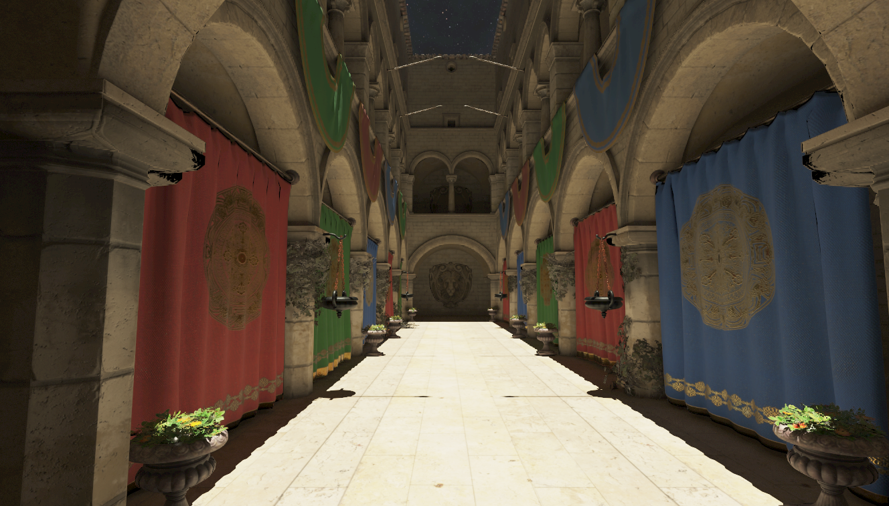
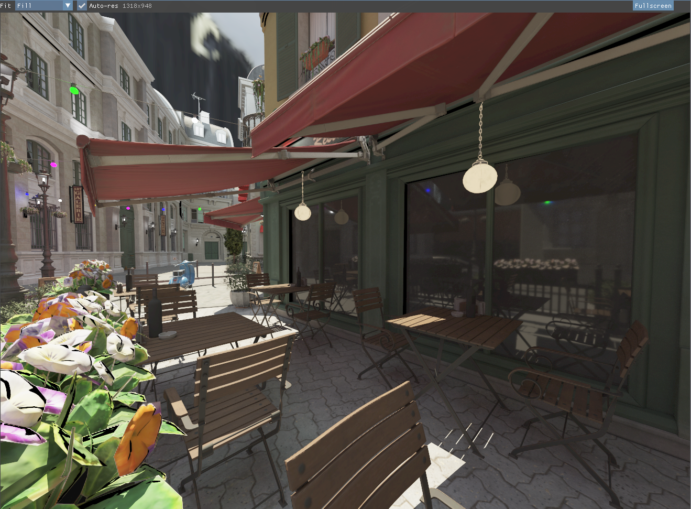

# CadThingo

A Vulkan renderer and engine written from scratch in C# (.NET 10) on top of
[Silk.NET](https://github.com/dotnet/Silk.NET). It runs six rendering techniques over one scene
representation: a deferred PBR pipeline, forward+, and four ray-traced modes ranging from a
ray-query megakernel to a wavefront path tracer and a ReSTIR direct-lighting core. Passes are
scheduled by a compiled frame graph that derives its own barriers, and shaders are authored in
Slang and compiled at runtime.


---

## What is interesting here

Three systems carry most of the design work.

### Frame graph

Rendering techniques are built as a directed acyclic graph of passes. A pass declares which
resources it reads and writes; the graph derives every image and buffer barrier from those
declarations, assigns passes to graphics, compute or transfer queues, batches submits, and inserts
timeline semaphores where async compute crosses a queue boundary. It also owns the descriptor sets
its passes bind.

Everything is decided once, in `Compile()`: barriers, schedule order, queue assignment, submit
batching, descriptor writes and transient allocation all bake into arrays on the passes. `Execute()`
replays those arrays with no per-frame analysis, allocation, or dictionary lookup. A resize throws
the graph away and compiles a new one.

Four of the five render cores build their frame through it. Full design and authoring documentation
lives in [`FrameGraph/README.md`](CadThingo/VulkanEngine/Renderer/FrameGraph/README.md).

### Reflection-driven descriptors

`slang.dll` is hosted in-process, so the engine compiles and reflects `.slang` sources at runtime.
`DescriptorRegistry` reads `SceneBindings.slang` into a canonical set-0 layout and matches resources
to bindings **by parameter name**, so renaming a binding in a shader does not mean editing an index
in C#. Push-constant ranges and specialization-constant ids come from the same reflection.

Registering a new handle for a name queues a rewrite that lands right after that frame's fence wait,
the one moment the set is provably not in flight. Bindless material textures ride the same queue.
Pass-local sets are baked by the frame graph at compile time.

### Feature lifecycle

Each feature registers itself into `FeatureCatalog` from a module initializer before `Main` runs, so
adding one is a new file. `Renderer` never names a feature: `FeatureHost` constructs, wires,
initializes, phase-pumps and disposes them.

A feature's descriptor carries a gate that reads device capabilities. Failing the gate means the
feature is never constructed rather than constructed and disabled, so its resources are never
allocated on hardware that cannot use them. `FeatureHost.Dump` prints the resulting manifest at
runtime, including what the gates excluded on that machine.

---

## Render modes

Selected at runtime from the editor. All six run against the same extracted scene.

| Mode | Technique |
|---|---|
| `Deferred` | G-buffer pass, GPU draw culling, tiled light culling, PBR resolve |
| `ForwardPlus` | Tiled light culling with a forward opaque and transparent pass |
| `RayCompute` | Megakernel path tracer on a compute pipeline using `VK_KHR_ray_query` |
| `RayTrace` | Path tracer on `VK_KHR_ray_tracing_pipeline`, with shader-execution reordering where the device exposes it |
| `RayWavefront` | Wavefront path tracer: SoA ray queues, `vkCmdDispatchIndirect`, material-sorted shading |
| `ReStirDI` | ReSTIR direct illumination on top of the ray-tracing pipeline |

---

## Features

**Shading and lighting**
- Metallic-roughness PBR with a full G-buffer and tiled light culling.
- Image-based lighting baked on the GPU: equirectangular HDR -> cubemap, irradiance convolution,
  prefiltered environment maps, and BRDF LUT generation.
- Reflection probes over a clustered probe grid with GPU probe capture.
- Compute draw culling and per-tile light culling.

**Ray tracing**
- Three path tracers sharing one set of Slang sampling modules, so a BRDF change lands in all of
  them at once.
- BLAS built with `AllowCompaction` and compacted after build, which shrinks the resident BVH.
- Acceleration-structure verbs sit behind a thin `gfx.As.*` facet; what to build stays renderer
  policy.

**Resources and memory**
- Block suballocator in front of `vkAllocateMemory`, so the engine stops burning one of the driver's
  4096 allocation slots per buffer or image, and releases empty blocks back to the driver.
- GPU block compression at load time (BC1/BC3/BC4/BC5) driven by a compute kernel.
- 24-byte vertices: position, octahedral-encoded normal, and UV in one shared buffer, with tangents
  derived in the shader.
- Residency hints through `VK_EXT_memory_priority` and `VK_EXT_pageable_device_local_memory`, with
  live budget read from `VK_EXT_memory_budget`.

**Engine**
- ECS with entities in unmanaged memory, so a raw `Entity*` needs no GC pin. 64 component slots per
  entity, O(1) lookup, and a component lifecycle state machine.
- `EventBus` pub/sub with categories for application, input, keyboard, mouse and window, type-safe
  dispatch, and single-consumer subscriptions.
- glTF and OBJ loading through SharpGLTF and Assimp, with vertex deduplication and bindless
  materials.
- ImGui editor: viewport, scene outliner, inspector, camera, renderer settings, stats, file browser.

|                                                       |                                                                 |
|-------------------------------------------------------|-----------------------------------------------------------------|
|                    |                                |
|  |  |

---

## Shaders

Shaders are authored in [Slang](https://github.com/shader-slang/slang). Shared modules live in
`VulkanEngine/Shaders/`; per-feature kernels live beside the feature that owns them in
`Renderer/Features/<Feature>/Kernels/`. A pipeline names its module by overriding
`PipelineBase.Program` with a `ShaderCompileRequest`, and SPIR-V, push-constant ranges and
spec-constant ids all come back from reflection.

Compilation happens at runtime through `slang.dll`, with SPIR-V and reflection disk-cached under
`Assets/ShaderCache/` keyed on source hashes. The first run on a clean clone compiles all 39 kernels
in a few seconds; later runs load from cache. Edit a shader and run.

Because the build never sees a shader, a syntax error would otherwise surface as a runtime crash.
`--shader-audit` is the check:

```bash
dotnet run --project CadThingo -- --shader-audit
```

It compiles and reflects every kernel headlessly with no device, and reports failures, cross-kernel
binding drift, and a matrix-layout regression guard. `0 col-major` is the expected result.

---

## Tech stack

| Concern | Library | Version |
|---|---|---|
| Vulkan bindings | Silk.NET.Vulkan | 2.23.0 |
| Windowing and input | Silk.NET (GLFW backend) | 2.23.0 |
| Shader compilation | Slang (`slang.dll`, hosted in-process) | from the Vulkan SDK |
| UI | ImGui.NET | 1.91.6.1 |
| Image loading | SixLabors.ImageSharp | 3.1.12 |
| glTF loading | SharpGLTF | 1.0.6 |
| OBJ loading | Silk.NET.Assimp | 2.23.0 |

**Required Vulkan extensions:** `VK_KHR_swapchain`, plus `VK_EXT_debug_utils` in debug builds.

**Optional, probed at device creation:** dynamic rendering and dynamic-rendering local read,
acceleration structure, ray-tracing pipeline, ray query, descriptor indexing, robustness2,
depth-stencil resolve, shader tile image, memory priority, pageable device-local memory, memory
budget, and `VK_NV_ray_tracing_invocation_reorder` for SER. Anything missing gates off the features
that need it instead of failing startup.

---

## Building and running

Requires the **.NET 10 SDK**, a Vulkan-capable GPU and driver, the **Vulkan SDK** with `VULKAN_SDK`
set (the engine loads `slang.dll` from `%VULKAN_SDK%\Bin`), and **Git LFS** for the sample assets.

```bash
git clone https://github.com/TheHokester/CadThingo.git
cd CadThingo

dotnet build CadThingo.sln --configuration Release
dotnet run   --project CadThingo --configuration Release
```

The sample models and HDR environments total several hundred megabytes. For a code-only clone, set
`GIT_LFS_SKIP_SMUDGE=1` before cloning.

Two headless developer entry points bring up no device:

```bash
dotnet run --project CadThingo -- --shader-audit   # compile and reflect every kernel
dotnet run --project CadThingo -- --slang-smoke    # exercise the Slang interop layer
```

Unsafe blocks are enabled across both projects for Vulkan interop and ECS pointer arithmetic. There
are no automated tests; `--shader-audit` is the closest thing to one.

---

## Project layout

```
CadThingo/
  CadThingo/                      # Executable
    VulkanEngine/
      Renderer/
        FrameGraph/               # Compiled DAG: barriers, queues, descriptors (see its README)
        Descriptors/              # DescriptorRegistry, reflected scene set, constant arena
        FeatureLifecycle/         # FeatureCatalog, FeatureHost, phase interfaces
        Features/                 # One directory per feature: pipelines, core, module, kernels
        Pipelines/                # Graphics / compute / RT pipeline bases and layout cache
        Slang/                    # In-process Slang compiler, reflection walker, disk cache
        GraphicsDevice.cs         # Instance, device, queues, allocator, AS verbs
        GpuScene.cs               # Scene extraction into GPU buffers
        Renderer.cs               # Composition root
      ECS, Events, GLTF, ImGui, Shaders
    Assets/                       # Models, Textures, ShaderCache (derived, gitignored)
  CadThingo.Graphics/             # Abstract 3D asset types, shapes, materials, serialization
  docs/                           # Design notes and working documents
```

---

## Status and roadmap

Under active development. Current direction:

- Finish ReSTIR DI, then spatial reuse and a temporal denoiser.
- Multiple importance sampling on the path tracers.
- Split static and dynamic acceleration structures behind one wrapper.
- Route the forward+ core through the frame graph, the last core still recording by hand.
- Implement scene ray casting for object picking through a dedicated compute dispatch.

Lighting is tiled rather than clustered, a deliberate choice for the scene sizes in use.
