# Wavefront Path Tracer (graph-resident, dispatchIndirect, SoA)

## Context

CadThingo's current ray-query path tracer is a **megakernel**: one compute kernel
(`Shaders/PTCompute.slang`, dispatched by `PTComputePipeline`) runs the whole per-pixel
bounce loop, driven by `PathtraceComputeCore : PathTraceCoreBase` with hand-written image
barriers, *outside* the render graph (`PathTraceCoreBase.Render`, `:99-155`).

Megakernels waste GPU lanes: divergent materials / bounce depths / terminated rays stall
whole warps, gated by the longest path in the warp. A **wavefront** tracer splits the loop
into separate compute passes joined by GPU work queues and uses `vkCmdDispatchIndirect` so
each stage launches only the lanes still alive that bounce. The `FrameGraph`
(`Renderer/FrameGraph/`) derives Sync2 barriers from usage declarations, culls dead passes,
times each pass, and exports DOT.

**Primary objective: performance.** That drives three structural decisions baked into this
plan: (1) **SoA, not AoS**, for every interpass buffer — each pass streams only the fields it
touches; (2) **store nothing that can be recomputed** — the fat per-hit material struct never
hits memory, `Shade` re-derives it; (3) **one kernel per file** under the §14 feature-folder
model, which also gives one `.spv` + one `main` entry per kernel (matching every existing
pipeline and sidestepping multi-entry-module fragility).

Locked decisions: full split `Generate → [Extend → Shade → Connect]×N → Finalize → Tonemap`
with a dedicated shadow queue; new `RenderMode.RayWavefront` alongside `RayCompute` for A/B +
fallback (megakernel + RT cores untouched); phased P1 (diffuse + env) → P2 (parity) → P3
(material-sorted shading — the layout is built for it from P1).

### Confirmed against the code

- Graph derives **buffer** barriers from `b.Read/Write` on `GraphBuffer` handles
  (`FrameGraph.cs:482-513`); `IndirectArg` maps to `DrawIndirectBit | IndirectCommandReadBit`
  (`ResourceUsage.cs:79`), valid for `vkCmdDispatchIndirect`. `AccelStructRead` already
  includes `ComputeShaderBit` (`:110-113`) for ray-query-in-compute.
- **Buffer ownership: pipeline-owned + imported.** Graph transients are reallocated every
  `Compile()` (`FrameGraph.cs:363`), which would force a descriptor rebind each build. Instead
  the pipeline owns the device-local SoA buffers (created at render extent) and the module
  **imports** them (`scope.ImportBuffer`) so barriers still derive — exactly how
  `DeferredModule` imports cull/instance buffers (`DeferredModule.cs:98-115`). Single-handle
  import (not per-frame): GPU-only, single-buffered, regenerated each frame; on one graphics
  queue frame N finishes before N+1, and imports are seeded `AllCommands/MemoryRW` each Execute
  (`FrameGraph.cs:444`), covering cross-frame hazards.
- **Tonemap is a direct pass**, not `TonemapModule` (its `ExpectImage` enforces R16F at
  `TonemapModule.cs:42`; `PtOutColor` is R32F at `RenderTargets.cs:142`). Read imported
  `PtOutColor`, write imported `FinalColor`, call `tonemapPipeline.Record(cmd, f, res.View(fc))`
  (`TonemapPipeline.cs:56`); HDR descriptor re-pointed to `PtOutColor.ImageView` in `Activate`
  (`PathTraceCoreBase.cs:49-51`).

## Architecture

### Stage / dependency topology (bounce body unrolled at graph-build time)

```mermaid
flowchart LR
  Gen[Generate<br/>dense, rayCount=W*H] --> PE0[PrepExtendArgs<br/>1 wg]
  PE0 --> Ex0[Extend<br/>dispatchIndirect]
  Ex0 --> PS0[PrepShadeArgs<br/>1 wg]
  PS0 --> Sh0[Shade<br/>dispatchIndirect]
  Sh0 --> PC0[PrepConnectArgs<br/>1 wg]
  PC0 --> Cn0[Connect<br/>dispatchIndirect]
  Cn0 -.->|nextRayQueue / counters| PE1[PrepExtendArgs b1] --> dots[" … ×MAX_BOUNCES … "]
  dots --> Fin[Finalize<br/>accum += L; out = normalize]
  Fin --> TM[Tonemap<br/>PtOutColor → FinalColor]
```



`MAX_BOUNCES` (8) fixes the pass list (~6/bounce + Generate/Finalize/Tonemap ≈ 52 passes).
`Prep*` = `CmdDispatch(1,1,1)`; `Extend/Shade/Connect` = `CmdDispatchIndirect`;
`Generate/Finalize` = dense `CmdDispatch(ceil(W/8),ceil(H/8),1)`.

### Interpass buffer layouts (SoA)

All state lives in **one buffer per field** (field-level SoA), so a pass touches only the
field-buffers it reads/writes instead of dragging a fat AoS record through cache. Sized to the
render extent (`pathCount = W*H`). Vectors use `float4` for aligned 16 B access, with spare
`w` lanes carrying naturally co-resident scalars (documented per field). A **new descriptor set
4** isolates these from the borrowed/frame sets (set 0 = frame IO, 1 = geom, 2 = bindless, 3 =
IBL — all copied verbatim from `PTComputePipeline`). Declared once in the shared
`WavefrontBindings.slang` so all six kernels share an identical layout:

```slang
// set 4 — wavefront working set (pipeline-owned, imported into the graph)

// Persistent path state — survives every bounce. Indexed by pathIdx (= pixel index).
[[vk::binding(0,4)]]  RWStructuredBuffer<float4> psRayOrigin;  // xyz = ray O          (w free)
[[vk::binding(1,4)]]  RWStructuredBuffer<float4> psRayDir;     // xyz = ray D          (w = prevBsdfPdf, P2 MIS)
[[vk::binding(2,4)]]  RWStructuredBuffer<float4> psThroughput; // xyz = throughput β   (w = packed flags: prevWasDelta|inMedium, P2)
[[vk::binding(3,4)]]  RWStructuredBuffer<float4> psRadiance;   // xyz = radiance L     (w free)
[[vk::binding(4,4)]]  RWStructuredBuffer<uint>   psRng;        // PRNG state (own array: frequent RMW, perfect coalescing)
[[vk::binding(5,4)]]  RWStructuredBuffer<float4> psSigmaA;     // xyz = medium σ_a     (P2 only; omit binding in P1)

// Compact hit — transient Extend→Shade. Indexed by pathIdx (NOT by queue slot): a material
// sort/bin reorders the index list, so the hit must stay reachable from pathIdx, not from a
// position that the sort destroys (see "Material-sorted shading"). Everything else recomputed.
[[vk::binding(6,4)]]  RWStructuredBuffer<uint2>  hitRecPrim;   // x = recordIndex (instanceID+geometryIndex), y = primIdx
[[vk::binding(7,4)]]  RWStructuredBuffer<float>  hitT;         // committed ray t
[[vk::binding(8,4)]]  RWStructuredBuffer<float2> hitBary;      // committed barycentrics

// Work queues — index lists (this is the ONLY thing a material sort reshuffles; state stays put).
// rayQueue ping-pongs by bounce parity (src/dst via push constant). shadeQueue is a single bin in
// P1; P3 replaces it with one bin per shading class (below).
[[vk::binding(9,4)]]  RWStructuredBuffer<uint>   rayQueue0;
[[vk::binding(10,4)]] RWStructuredBuffer<uint>   rayQueue1;
[[vk::binding(11,4)]] RWStructuredBuffer<uint>   shadeQueue;   // pathIdx that hit this bounce

// Shadow records — Shade→Connect. Indexed by SHADOW SLOT (dense [0,shadowCount)). ≤1 record
// per path per bounce ⇒ shadowPath values are unique ⇒ Connect's radiance add needs no atomics.
[[vk::binding(12,4)]] RWStructuredBuffer<uint>   shadowPath;   // target pathIdx
[[vk::binding(13,4)]] RWStructuredBuffer<float4> shadowOrigin; // xyz = O, w = tMax
[[vk::binding(14,4)]] RWStructuredBuffer<float4> shadowDir;    // xyz = D              (w free)
[[vk::binding(15,4)]] RWStructuredBuffer<float4> shadowLe;     // xyz = precomputed β·f·W·Le·cosθ contribution

// Counters + indirect args. Both array-shaped so the shade stage can fan out to one entry
// per shading class in P3 (shadeCount[c] / shade-args[c]) with sizing-only changes.
[[vk::binding(16,4)]] RWStructuredBuffer<uint>   counters;     // rayCount, shadeCount[C], shadowCount, nextRayCount  (C=1 in P1/P2)
[[vk::binding(17,4)]] RWStructuredBuffer<uint>   dispatchArgs; // VkDispatchIndirectCommand[]: extend, shade[C], connect
```

C# side: `WavefrontPTPipeline` allocates one `GraphicsDevice.CreateBuffer(size, usage,
DeviceLocalBit)` per field (`:1209`); `dispatchArgs` gets `IndirectBufferBit | StorageBufferBit`,
the rest `StorageBufferBit`. Descriptors for set 4 are written once at init + on resize (stable
pipeline-owned handles), like `DrawCullPipeline.WriteDescriptors`. The module imports each via
`scope.ImportBuffer` for barrier derivation; pass bodies read the args handle straight off the
pipeline (e.g. `_pipeline.DispatchArgsBuffer`) for `CmdDispatchIndirect`, mirroring
`DeferredModule` calling `_cull.GetIndirectCmdBuffer`.

### Store vs. recompute (the memory-traffic discipline)

**Stored** (cannot be cheaply recomputed): the persistent path state (β, L, rng, ray O/D —
the next ray direction is a random BSDF sample; the origin depends on the prior hit, gone by
the next pass); the compact hit (Extend→Shade); the shadow record incl. its **precomputed**
scalar contribution (Shade→Connect). P2 adds prevBsdfPdf/prevWasDelta (MIS) and medium σ_a
(Beer-Lambert) — both genuinely path-history-dependent.

**Recomputed in `Shade`, never stored** — this is the win that keeps `pathState` lean and is
why the fat `HitInfo` (`PTUtils`/`PTCompute.slang:135-308`, ~30 scalars: worldPos, shading +
geometric normal, tangent, UV, baseColor, metallic, roughness, emissive, transmission, ior,
F0, clearcoat×3, frontFace) is **not** an interpass buffer. `Shade` calls `resolveHit` on the
compact hit:

- `worldPos = psRayOrigin + psRayDir * hitT` — 1 mad, vs storing a float3.
- normals / tangent / UV — re-fetched from `globalVertices` via `recordIndex`+`primIdx`+`bary`.
- all material params — re-sampled from textures/`materials[recordIndex]` (the same fetches
  the megakernel does; `MATERIAL_LOD_BOUNCE` still skips detail fetches on deep bounces).
- `frontFace` — recomputed from `dot(geometricNormal, rayDir)`.

Also **never stored** because they are constants or trivially derived: `bounce` (a compile-time
literal per unrolled pass — at most a push constant), pixel coords (`= pathIdx % W`, `pathIdx /
W`), ray `tMin`/`tMax` (literals 0 / ∞).

### Counter lifecycle (per bounce b)

`Generate`: `rayQueue0[p]=p`, thread 0 sets `counters.rayCount=W*H`, `nextRayCount=0`.
`PrepExtendArgs(b)`: `dispatchArgs.extend = ceil(rayCount/64)`; reset `shadeCount=0`.
`Extend(b)`: read `rayQueue[b&1]`; trace; miss → `psRadiance += psThroughput*env`, terminate;
hit → write `hit*[pathIdx]`, then `slot = atomicAdd(shadeCount,1)`, `shadeQueue[slot]=pathIdx`.
`PrepShadeArgs(b)`: `dispatchArgs.shade = ceil(shadeCount/64)`; reset `shadowCount=0`,
`nextRayCount=0`. `Shade(b)`: BSDF sample + RR → `slot=atomicAdd(nextRayCount,1)`;
`rayQueue[(b+1)&1][slot]=pathIdx`; update β, psRayO/D; NEE pick →
`s=atomicAdd(shadowCount,1)`, write `shadow*[s]`. `PrepConnectArgs(b)`: `dispatchArgs.connect
= ceil(shadowCount/64)`. `Connect(b)`: occlusion ray; unshadowed →
`psRadiance[shadowPath[s]] += shadowLe[s]`. `PrepExtendArgs(b+1)`: copy `nextRayCount →
rayCount`, set `extend` args, reset `shadeCount`.

### Material-sorted shading (the divergence win this layout is built for)

Shade-time divergence — diffuse vs conductor vs glass vs clearcoat taking different
`resolveHit`/`sampleBsdf` paths in one warp, the warp gated by the heaviest lobe present — is the
dominant remaining stall once the loop is split. The fix: **bin hit paths by shading class in
`Extend`, then run a specialized Shade PSO per class.** SoA is what makes this cheap — β/L/ray/rng
are `pathIdx`-indexed and never move; the sort reshuffles only a `uint` index list, and the
compact hit is `pathIdx`-indexed (the correction above) so it survives the reshuffle. Direct
routing (per-class `atomicAdd`) avoids any global radix/prefix-sum, and the *C* Shade PSOs reuse
the exact spec-constant loop that already bakes Generate into 4 camera-mode PSOs
(`PTComputePipeline.cs:159-221`). The full build order — including the **superset-ordered class
taxonomy** that is what keeps per-class lobe-stripping *correct*, not just fast — is **Phase 3**.

### Accumulator / output (imported, layouts preserved)

Import host-owned `PtAccumulator` + `PtOutColor` (R32F, permanently `General`,
`RenderTargets.cs:137-145`) `Initial=Final=General` (no Undefined discard → accumulation
survives). `Finalize`: `StorageRWCompute` accumulator, `StorageWriteCompute` outColor; same
`resetAccum` tail as the megakernel (`PTCompute.slang:751-757`). `Tonemap` reads `PtOutColor`
`SampledFragment` (General→ShaderReadOnly; closing barrier restores General) and writes
`FinalColor` (imported `Undefined → ShaderReadOnlyOptimal` for the host post-stack).

## Files (§14 feature-folder model)

New folder `Renderer/Features/PathTracerWavefront/` — passes, pipeline, and per-kernel sources
in `Kernels/`, so the graph boundary and on-disk boundary coincide (§14.1). `.spv` output stays
flat in `Assets/Shaders/` (§14.3: source and output are separate axes):

```
Renderer/Features/PathTracerWavefront/
    WavefrontPTModule.cs       IGraphModule — imports buffers + accum/outColor/FinalColor,
                               unrolls the bounce passes, Finalize + direct Tonemap pass.
                               Template: Features/Deferred/DeferredModule.cs
    WavefrontPTCore.cs         IRenderCore — owns the FrameGraph, builds in ctor/Resize,
                               Execute in Render, camera-dirty reset, Activate re-points
                               tonemap. Template: DeferredCore.cs + PathTraceCoreBase.cs:74-95
    WavefrontPTPipeline.cs     Owns the 6 kernel PSOs (Generate = 4, by camera-mode spec id=3)
                               + the set-4 SoA buffers + the shared layout/sets (1/2/3 verbatim
                               from PTComputePipeline). Record{Generate,PrepArgs,Extend,Shade,
                               Connect,Finalize}. Template: PTComputePipeline.cs + DrawCullPipeline.cs
    Kernels/
        WavefrontBindings.slang  shared: PathFrameUBO + set 0/1/2/3 (copied from PTCompute) +
                                 set 4 SoA (above) + pack/unpack helpers. import-ed by all kernels.
        WavefrontShading.slang   shared (P2): resolveHit, isOccluded, sampleLightRIS,
                                 sampleEmissive, computeAlpha/UV, mediumSigmaA — extracted from
                                 PTCompute.slang; references the scene bindings in WavefrontBindings.
        Generate.slang  Extend.slang  Shade.slang  Connect.slang  Finalize.slang  PrepareArgs.slang
                                 each: `import WavefrontBindings; import PTUtils;` + one
                                 `[shader("compute")] void main(...)`.
```

**One entry per file → one `.spv` per kernel**, each loaded with `PName="main"` (the universal
convention, `Pipelines.cs:268`). `CreatePipeline` reads 6 `.spv`s and builds 6 PSOs (Generate
×4 via the spec-constant loop at `PTComputePipeline.cs:159-221`). This removes the
multi-entry-in-one-module question entirely. The shared `import` modules guarantee every
kernel sees the same set/binding numbers.

**Touched:** `Renderer_Core.cs` (enum `RayWavefront=4` at `:68-74`; `CoreFor` arm `:89-96`;
instantiate `wavefrontCore = new WavefrontPTCore(this)` at `:428` with the same post-init
`Write*Descriptor` + TLAS rebinds as `ptComputePipeline` `:400-419`; `Dispose` `:643`).
`Renderer_Rendering.cs` (`wavefrontCore.Resize` next to `ptComputeCore.Resize` `:109`).
`RendererSettingsPanel.cs` (append `_renderModeLabels` `:64-70`). `shaderCompile.bat` (6 new
`slangc … -capability spvRayQueryKHR -I Kernels …` lines, mirroring `:15` — note `-I` for the
shared imports / `Shaders/Lib`). Delete placeholder stubs
`Features/PathTracer/PTComputeModule.cs` + `PTRTModule.cs` (empty, wrong namespace).

### Reuse (do not reimplement)

- **`PTUtils.slang`** (binding-free math): `initRNG`/`rand`, `generate*Ray` +
  `transformRayToWorld` (MODE branch spec-driven, `PTCompute.slang:89-106`),
  `sampleBsdf`/`bsdfPdfForDir`/`evaluateFullBrdf`, `sampleCosineHemisphere`, `powerHeuristic`,
  `luminance`, `tentWarp`, `HitInfo`, `EmissiveTri`/`AliasEntry`.
- **Borrowed scene descriptors** — copy `PTComputePipeline.Write{Geometry,Lights,Tlas,
  ShadowInfo,Emissive,Ibl}Descriptor` verbatim (`:319-477`); renderer calls them after init.
- Pass body resolves graph views via `res.View(h)` (`GraphPass.cs:53`).

## Phase 1 — plumbing renders (diffuse + env) (build order)

Goal of P1: a fully **graph-resident** wavefront tracer that produces a *converging* image of
diffuse surfaces lit by the environment, with real indirect bounces — every stage split, every
queue/counter/indirect-dispatch live, but every non-diffuse feature stubbed. This proves the hard
part (the graph topology, SoA imports, indirect chain, accumulation) before any BSDF richness.
Each sub-step compiles; the first runnable image lands at **P1.9**.

### P1.0 Decisions locked for this phase

- **5 descriptor sets:** 0–3 copied verbatim from `PTComputePipeline.CreateDescriptorSetLayouts`
  (`PTComputePipeline.cs:107-143`); set 4 = the SoA working set (Architecture above). Set 0
  already carries the accumulator + outColor as storage images (bindings 4/5) and `entityInfo`
  (binding 3) — so Finalize writes the image via the *same* `WriteStorageImageDescriptors` path
  the megakernel uses; no separate image descriptor plumbing.
- **Pipeline owns the set-4 buffers** (device-local, single-buffered) and the module **imports**
  them (`scope.ImportBuffer(buf, default, name)`, `FrameGraph.cs:100`). Single graphics queue ⇒
  frame N completes before N+1; imports are seeded `AllCommands/MemoryRW` each Execute
  (`FrameGraph.cs:444`).
- **One entry per kernel file → one `.spv`**; 6 PSOs (Generate ×4 by camera-mode spec id 3).
- P1 leaves `psSigmaA` + the MIS/flag `w`-lanes allocated but unwritten.

### P1.1 `WavefrontPTPipeline` — sets, buffers, PSOs (`Features/PathTracerWavefront/`)

Subclass the pipeline base like `PTComputePipeline`/`DrawCullPipeline`. Three responsibilities:

```csharp
// (a) Layout: sets 0–3 verbatim from PTComputePipeline (copy CreateDescriptorSetLayouts:107-143),
//     then set 4 = 18 storage-buffer bindings. PipelineLayout spans all 5.

// (b) Device-local SoA buffers at render extent (GraphicsDevice.CreateBuffer:1209).
void AllocSet4(uint pathCount) {
    ulong f4 = (ulong)pathCount * 16, u1 = (ulong)pathCount * 4;
    Gfx.CreateBuffer(f4, BufferUsageFlags.StorageBufferBit, MemoryPropertyFlags.DeviceLocalBit,
                     out PsRayOrigin, out _a0);            // …one per field…
    Gfx.CreateBuffer(DispatchArgsBytes, BufferUsageFlags.StorageBufferBit |
                     BufferUsageFlags.IndirectBufferBit,  MemoryPropertyFlags.DeviceLocalBit,
                     out DispatchArgsBuffer, out _aArgs);  // counters likewise (no TransferDst:
}                                                          // PrepareArgs resets them in-shader)

// (c) 6 PSOs from 6 .spv. Generate loops 4× over the camera-mode spec constant exactly as
//     PTComputePipeline.CreatePipeline:159-221 (_modePipelines[mode]); the other 5 are single PSOs.
```

`WriteSet4Descriptors()` writes all 18 bindings once (stable device-local handles), following the
`DrawCullPipeline.WriteDescriptors` `VkWriteDescriptorSet`/`DescriptorBufferInfo` pattern
(`DrawCullPipeline.cs:144-188`). Re-called on resize after realloc. Reuse `PathFrameUBO` verbatim
(`PTComputePipeline.cs:27-48`). Build: pipeline constructs, no graph yet.

### P1.2 `Kernels/WavefrontBindings.slang` — the shared layout

`import`-ed by every kernel so all six see identical set/binding numbers. Holds: `PathFrameUBO` +
sets 0–3 (copied from `PTCompute.slang`'s declarations) + the set-4 block (Architecture) + counter
index constants + a push-constant block:

```slang
static const uint RAY_COUNT = 0, SHADE_COUNT_0 = 1, SHADOW_COUNT = 5, NEXT_RAY_COUNT = 6;
struct WavefrontPush { uint bounce; uint srcParity; uint argsClass; }; // bounce parity + P3 class
[[vk::push_constant]] WavefrontPush pc;
uint rdRay(uint i)        { return pc.srcParity==0 ? rayQueue0[i] : rayQueue1[i]; }
void wrRay(uint i, uint v){ if (((pc.bounce+1)&1)==0) rayQueue0[i]=v; else rayQueue1[i]=v; }
```

Build: compiles standalone (`slangc … -I Kernels`). (`SHADE_COUNT_0` leaves slots 1–4 for P3's
`shadeCount[4]`; `SHADOW_COUNT`/`NEXT_RAY_COUNT` sit after.)

### P1.3 `Kernels/PrepareArgs.slang` — the 1-workgroup arg/counter kernel

One kernel, parameterized by push constant (`countIndex`, `argsByteOffset`, `resetMask`,
`copyNextToRay`), dispatched `CmdDispatch(1,1,1)` at each `Prep*` node:

```slang
[shader("compute")] [numthreads(1,1,1)] void main() {
    if (pc.copyNextToRay != 0) { counters[RAY_COUNT] = counters[NEXT_RAY_COUNT]; counters[NEXT_RAY_COUNT] = 0; }
    uint n = counters[pc.countIndex];
    dispatchArgs[pc.argsByteOffset/4 + 0] = (n + 63u) / 64u;   // VkDispatchIndirectCommand.x
    dispatchArgs[pc.argsByteOffset/4 + 1] = 1; dispatchArgs[pc.argsByteOffset/4 + 2] = 1;
    if ((pc.resetMask & 1u) != 0) counters[SHADE_COUNT_0] = 0;
    if ((pc.resetMask & 2u) != 0) { counters[SHADOW_COUNT] = 0; counters[NEXT_RAY_COUNT] = 0; }
}
```

Build: compiles. (Distinct `Prep{Extend,Shade,Connect}Args` are this kernel with different push
constants — one `.spv`, three graph nodes.)

### P1.4 `Kernels/Generate.slang` — dense primary rays

Reuse `initRNG`/`tentWarp`/`rand`/`generatePrimaryRay`/`transformRayToWorld` verbatim (the exact
sequence at `PTCompute.slang:530-541`, `89-106`):

```slang
[shader("compute")] [numthreads(8,8,1)] void main(uint3 gid : SV_DispatchThreadID) {
    uint2 dim = uint2(frameUBO.screenSize); if (any(gid.xy >= dim)) return;
    uint p = gid.y*dim.x + gid.x;
    uint rng = initRNG(gid.xy, dim, frameUBO.frameIndex);
    float2 j = float2(tentWarp(rand(rng)), tentWarp(rand(rng)));
    float2 ndc = ((float2(gid.xy)+0.5+j)/frameUBO.screenSize)*2.0-1.0;
    ndc.x *= frameUBO.screenSize.x/frameUBO.screenSize.y;
    RayDesc ray = transformRayToWorld(generatePrimaryRay(ndc, rng), frameUBO.invView);
    psRayOrigin[p]=float4(ray.Origin,0); psRayDir[p]=float4(ray.Direction,0);
    psThroughput[p]=float4(1,1,1,0); psRadiance[p]=float4(0,0,0,0); psRng[p]=rng; rayQueue0[p]=p;
    if (p==0) { counters[RAY_COUNT]=dim.x*dim.y; counters[NEXT_RAY_COUNT]=0; }
}
```

### P1.5 `Kernels/Extend.slang` — trace + miss + atomic-append (P1: opaque only)

P1 skips the alpha `Proceed()` loop (`q.Proceed()` once, opaque commit); P2 layers it in.

```slang
[shader("compute")] [numthreads(64,1,1)] void main(uint3 tid : SV_DispatchThreadID) {
    if (tid.x >= counters[RAY_COUNT]) return;
    uint p = rdRay(tid.x);
    RayDesc ray; ray.Origin=psRayOrigin[p].xyz; ray.Direction=psRayDir[p].xyz; ray.TMin=0; ray.TMax=INFINITY;
    RayQuery<RAY_FLAG_NONE> q; q.TraceRayInline(tlas, RAY_FLAG_NONE, 0xFF, ray);
    q.Proceed();
    if (q.CommittedStatus() != COMMITTED_TRIANGLE_HIT) {
        psRadiance[p].xyz += psThroughput[p].xyz * sampleEnv(ray.Direction); return; // terminate
    }
    hitRecPrim[p] = uint2(q.CommittedInstanceID()+q.CommittedGeometryIndex(), q.CommittedPrimitiveIndex());
    hitT[p] = q.CommittedRayT(); hitBary[p] = q.CommittedTriangleBarycentrics();
    uint slot; InterlockedAdd(counters[SHADE_COUNT_0], 1u, slot); shadeQueue[slot] = p;
}
```

### P1.6 `Kernels/Shade.slang` — minimal `resolveHit` + BSDF + re-queue

P1 calls a trimmed `resolveHit` (baseColor/normal/metallic/roughness — skip clearcoat/transmission
texels) and `sampleBsdf` (`PTUtils.slang:526`); emissive pickup without MIS; no NEE yet but writes
one **zero** shadow record so Connect exercises end-to-end:

```slang
[shader("compute")] [numthreads(64,1,1)] void main(uint3 tid : SV_DispatchThreadID) {
    if (tid.x >= counters[SHADE_COUNT_0]) return;
    uint p = shadeQueue[tid.x]; uint rng = psRng[p];
    HitInfo h = resolveHit(hitRecPrim[p], hitT[p], hitBary[p], psRayOrigin[p].xyz, psRayDir[p].xyz, pc.bounce);
    float3 V = -psRayDir[p].xyz;
    psRadiance[p].xyz += psThroughput[p].xyz * h.emissive;     // P1: no MIS weight
    BsdfSample bs = sampleBsdf(h, V, rng); psRng[p] = rng;
    if (!bs.valid) return;                                     // path dies (not re-queued)
    psThroughput[p].xyz *= bs.weight;
    float3 oN = bs.transmit ? -h.geometricNormal : h.geometricNormal;
    psRayOrigin[p]=float4(h.worldPos+oN*1e-3,0); psRayDir[p]=float4(bs.wi,0);
    uint slot; InterlockedAdd(counters[NEXT_RAY_COUNT], 1u, slot); wrRay(slot, p);
    uint s; InterlockedAdd(counters[SHADOW_COUNT], 1u, s);     // zero record (P1 keep-alive)
    shadowPath[s]=p; shadowOrigin[s]=float4(0,0,0,0); shadowDir[s]=float4(0,0,0,0); shadowLe[s]=float4(0,0,0,0);
}
```

### P1.7 `Kernels/Connect.slang` + `Kernels/Finalize.slang`

- `Connect.slang` (P1 stub): read the shadow record; with `shadowLe==0` the contribution is a
  no-op — proves the queue + indirect dispatch without an occlusion trace yet (P2 adds `isOccluded`).
- `Finalize.slang`: the accumulator tail verbatim (`PTCompute.slang:751-757`) — `accumulator` +
  `outColor` are the set-0 storage images (bindings 4/5), `resetAccum` from the UBO:

```slang
[shader("compute")] [numthreads(8,8,1)] void main(uint3 gid : SV_DispatchThreadID) {
    uint2 dim = uint2(frameUBO.screenSize); if (any(gid.xy >= dim)) return;
    uint p = gid.y*dim.x + gid.x; float3 L = psRadiance[p].xyz;
    if (any(isnan(L))||any(isinf(L))) L = float3(0);
    if (frameUBO.resetAccum != 0u) accumulator[gid.xy] = float4(L,1.0); else accumulator[gid.xy] += float4(L,1.0);
    float4 a = accumulator[gid.xy]; outColor[gid.xy] = float4(a.rgb/max(a.a,1.0), 1.0);
}
```

### P1.8 `WavefrontPTModule.Build` — import + unroll the indirect chain

`IGraphModule<Inputs,Outputs>` like `DeferredModule` (`DeferredModule.cs:26,68`). Import the 18
set-4 buffers + accum/outColor/FinalColor, then unroll. One representative pass (the rest follow
the same setup/execute shape; `Prep*` are dense `CmdDispatch(1,1,1)`, the three workers are
`CmdDispatchIndirect`):

```csharp
public void Build(GraphScope scope, in Inputs inp, out Outputs o) {
    var rayQ0 = scope.ImportBuffer(_pipe.RayQueue0, default, "rayQ0"); /* …18 imports… */
    var args  = scope.ImportBuffer(_pipe.DispatchArgsBuffer, default, "dispatchArgs");
    var accum = scope.ImportImage(_pipe.Accum, _pipe.AccumView, default, ImageLayout.General, "ptAccum");
    var outC  = scope.ImportImage(_pipe.OutColor, _pipe.OutColorView, default, ImageLayout.General, "ptOut");
    // Generate (dense) …
    for (uint b = 0; b < MAX_BOUNCES; b++) {
        AddPrep(scope, $"PrepExtend{b}", args, /*push*/…);                       // CmdDispatch(1,1,1)
        scope.AddPass($"Extend{b}", PassType.Compute, QueueClass.Graphics,
            bld => { bld.Read(rayQ0, ResourceUsage.StorageReadCompute);
                     bld.Read(tlasH, ResourceUsage.AccelStructRead);
                     shadeQ = bld.Write(shadeQ, ResourceUsage.StorageWriteCompute);
                     bld.Read(args, ResourceUsage.IndirectArg); /* …hit*, counters… */ },
            (cmd, res, in FrameContext f) => _pipe.RecordExtend(cmd, f, b, args /*offset*/));
        AddPrep(scope, $"PrepShade{b}", args, …); AddShade(scope, b, args);      // Shade (indirect)
        AddPrep(scope, $"PrepConnect{b}", args, …); AddConnect(scope, b, args);  // Connect (indirect)
    }
    // Finalize (dense) → Tonemap (direct pass, below). outputs = (FinalColor).
    o = new Outputs(finalH);
}
```

`RecordExtend` binds sets 0–4 once then `Vk.CmdDispatchIndirect(cmd, _pipe.DispatchArgsBuffer,
extendArgsByteOffset(b))`. **Tonemap** is a direct pass (not `TonemapModule` — its `ExpectImage`
demands R16F, `TonemapModule.cs:38-43`, but `PtOutColor` is R32F): read `outC` `SampledFragment`,
write `FinalColor`, call `_tonemap.Record(cmd, ctx, res.View(finalH))` (`TonemapPipeline.cs:56`).

### P1.9 `WavefrontPTCore` — own the graph (first runnable image)

Mirror `DeferredCore` (`DeferredCore.cs:56-123`): `BuildGraph()` from ctor + `Resize`, on
`fg.RootScope().Child("Wavefront")`; `module.Build`, `fg.MarkOutput(o.Final)`, `fg.Compile()`,
then `_pipe.WriteSet4Descriptors()` from the stable handles. `Render` = camera-dirty accumulator
reset (`PathTraceCoreBase.cs:74-84`) + `UpdatePerFrame` (fill `PathFrameUBO`) + `_graph.Execute(cmd,
ctx)`. `Activate()` re-points the tonemap HDR input to `PtOutColor.ImageView`
(`PathTraceCoreBase.cs:49-51`). Expose `GraphStats`/`ToDot` (`DeferredCore.cs:173-176`).

### P1.10 Wire the mode (`Renderer_Core.cs`, `Renderer_Rendering.cs`, settings panel)

- `RenderMode` enum (`Renderer_Core.cs:68-74`): add `RayWavefront = 4`.
- `CoreFor` (`:89-96`): add `RenderMode.RayWavefront => wavefrontCore`.
- Instantiate beside the others (`:427-432`): `wavefrontCore = new WavefrontPTCore(this);` and give
  it the same post-init `WriteTlas/ShadowInfo/Emissive/Ibl/Geometry/Lights/StorageImage`
  descriptor calls the megakernel pipeline gets (`:320-327, 400-401`); `Dispose` (`:642-645`).
- `Renderer_Rendering.cs:109`: `wavefrontCore.Resize(renderExtent);`.
- `RendererSettingsPanel.cs:64-70`: append `"Pathtracer (wavefront)"` to `_renderModeLabels`.

### P1.11 Shader build

`shaderCompile.bat` (after `:15`): six lines mirroring the PTCompute line, plus `-I Kernels` for the
shared imports:

```batch
slangc.exe Kernels/Generate.slang   -target spirv -capability spvRayQueryKHR -I Kernels -o ../../Assets/Shaders/WfGenerate.spv
slangc.exe Kernels/Extend.slang     -target spirv -capability spvRayQueryKHR -I Kernels -o ../../Assets/Shaders/WfExtend.spv
…  (Shade, Connect, Finalize, PrepareArgs) …
```

Delete the empty placeholder stubs `Features/PathTracer/PTComputeModule.cs` + `PTRTModule.cs`.

### P1.12 Per-phase verification

| After  | Check                                                                                            |
|--------|--------------------------------------------------------------------------------------------------|
| P1.7   | All six `.spv` compile; bindings resolve (slang sees one set-4 layout via the shared import).     |
| P1.9   | RayWavefront selectable; renders diffuse + environment with indirect bounces; image **converges** over frames; accumulation resets on camera move, rebuilds on resize. |
| P1.9   | `ToDot()` shows Generate → (PrepExtend→Extend→PrepShade→Shade→PrepConnect→Connect)×8 → Finalize → Tonemap; per-pass timings populate. |
| P1.9   | Vulkan validation clean (all barriers derived from the Read/Write usage declarations).           |
| P1.9   | RenderDoc: `extend/shade/connect` indirect args carry **shrinking** workgroup counts down bounces.|

### Gotchas

1. **Ping-pong correctness:** `srcParity` (push constant) selects `rayQueue0/1` for read; the write
   target is `(bounce+1)&1`. `PrepExtendArgs(b+1)` copies `NEXT_RAY_COUNT → RAY_COUNT` and zeroes
   `NEXT_RAY_COUNT` *before* `Extend(b+1)` reads it.
2. **Import for barriers, bind for access:** the set-4 buffers and accum/outColor are imported only
   so the graph derives barriers; the kernels still touch them through the bound descriptor sets,
   not through the graph handles. Both must point at the same device buffers.
3. **`counters`/`dispatchArgs` are device-local and reset in-shader** (`PrepareArgs`), so they need
   no `TransferDst`/`CmdFillBuffer` — unlike `DrawCullPipeline` which fills its count buffer.
4. **Static pass list:** `MAX_BOUNCES` is a build-time constant; the unrolled passes always exist.
   Late bounces with zero live rays dispatch `(0,1,1)` and are cheap/culled — never skip `AddPass`.

### Recommended order of attack

P1.1 → P1.2 (the two compile gates) → P1.3–P1.7 kernels (each `slangc`-compiles in isolation) →
P1.8 module → P1.9 core + P1.10 wiring + P1.11 build **together** (nothing renders until all three
land) → verify the P1.9 image converges. Bisect graph/sync regressions with `ToDot()` + validation.

## Phase 2 — feature parity (build order)

Layer megakernel features onto the P1 skeleton until RayWavefront and RayCompute converge to the
same image. **Guardrail:** the one change that touches the working megakernel is extracting shared
helpers (P2.1) — do it incrementally and re-verify RayCompute after each extraction; if a helper is
too invasive to share, duplicate it into `WavefrontShading.slang` (`PTUtils.slang` stays the
binding-free shared base). Each P2.x is independently A/B-testable against RayCompute.

### P2.0 Decisions locked for this phase

- Parity target = identical converged images on glass / emissive area lights / clearcoat /
  alpha-masked foliage / all camera modes. A/B by switching `RenderMode` on a fixed scene+seed.
- The MIS/medium `w`-lanes and `psSigmaA` (reserved in P1) come alive here; no new bindings.
- Order features by isolation: transparency → emissive/MIS → NEE → occlusion → transmission → RR.

### P2.1 Extract shared scene helpers — `Kernels/WavefrontShading.slang`

Move `resolveHit`, `isOccluded`, `sampleLightRIS`, `sampleEmissive`, `computeAlpha`/`computeUV`,
`mediumSigmaA` out of `PTCompute.slang` (bodies at `:135-308, 317-361, 381-428, 459-522` and
`PTUtils.slang:439-442`) into a shared module referencing the set-0/1/2 scene bindings in
`WavefrontBindings`. **Re-verify RayCompute** after each function moves. Build gate: both megakernel
and wavefront compile against the shared copy.

### P2.2 Alpha / stochastic transparency — `Extend`

Replace P1's single `q.Proceed()` with the candidate loop handling MASK (`flags&1`, `alpha≥cutoff`)
and BLEND (`flags&4`, `rand<alpha`) exactly as `PTCompute.slang:149-167`, committing via
`q.CommitNonOpaqueTriangleHit()`. A/B: alpha-masked foliage matches RayCompute.

### P2.3 Emissive pickup + MIS — `Shade`

Carry `prevBsdfPdf` in `psRayDir.w` and `prevWasDelta` in a `psThroughput.w` flag bit; weight the
emissive pickup with `powerHeuristic(prevBsdfPdf, pLight)` per `PTCompute.slang:614-626`. Set the
flags from the `BsdfSample.isDelta`/`pdf` when re-queuing the indirect ray. A/B: emissive area
lights converge without double-counting.

### P2.4 NEE — `Shade` writes real shadow records

Replace P1's zero record: 50/50 RIS-vs-emissive-alias pick (`PTCompute.slang:639-696`), build the
shadow ray (`origin = worldPos + geoN·1e-3`, `tMax = dist-2e-3`), and store the **precomputed**
contribution `throughput · evaluateFullBrdf · radiance · NdotL · weight / pPick` into `shadowLe`
(so Connect needs no material data). One record per path ⇒ `shadowPath` values unique.

### P2.5 Occlusion — `Connect`

Implement the real trace: `isOccluded(origin, dir, tMax, rng)` with the transmission/alpha gate
(`PTCompute.slang:317-361`); unshadowed ⇒ `psRadiance[shadowPath[s]].xyz += shadowLe[s].xyz`.
Unique `shadowPath` ⇒ no atomics. A/B: direct lighting + soft shadows match.

### P2.6 Transmission + Beer-Lambert — `Shade` + `Extend`

On `bs.transmit`, flip the next-ray origin to `-geometricNormal` and set `psSigmaA` from
`mediumSigmaA(material)` on entry / zero on exit (`PTCompute.slang:731-742`); apply
`throughput *= exp(-sigmaA · hitT)` over the traversed segment in `Extend` (`:604`). A/B: tinted
glass + TIR match.

### P2.7 Russian roulette + firefly clamp + NaN scrub

Add RR after `MIN_BOUNCES` (`luminance(throughput)` clamped `[0.05,0.95]`, `PTCompute.slang:721-725`)
and the per-bounce firefly clamp (`FIREFLY_CLAMP=256`, `:583`) in `Shade`; the NaN/Inf scrub is
already in P1's `Finalize`. RR honors the `RUSSIAN_ROULETTE` spec constant.

### P2.8 Camera modes + Material LOD

Generate's 4 PSOs already exist (P1.1); confirm all four `CameraMode` branches
(`PTCompute.slang:89-106`). Thread the per-pass `bounce` literal into `resolveHit` so
`MATERIAL_LOD_BOUNCE` (`:83`) skips detail-texture fetches on deep bounces.

### P2.9 Per-phase verification

| After  | Check                                                                                  |
|--------|----------------------------------------------------------------------------------------|
| P2.1   | RayCompute image **unchanged** after each helper extraction (the megakernel guardrail). |
| P2.2–8 | Per-feature A/B: RayWavefront == RayCompute on a scene exercising that feature.          |
| P2.9   | Full converged match across glass / emissive / clearcoat / foliage / all camera modes; RayWavefront shows higher live-lane occupancy on divergent scenes in the graph timings. |

### Gotchas

1. **Extraction is the only megakernel risk** — gate every moved helper behind a RayCompute A/B; a
   silent change there regresses the shipping renderer, not just the new path.
2. **MIS state must round-trip the queue:** `prevBsdfPdf`/`prevWasDelta` are written by `Shade(b)`
   into the `w`-lanes and read by `Shade(b+1)` after `Extend(b+1)` — they are path history, so they
   live in persistent state, not the compact hit.
3. **NEE contribution is precomputed in `Shade`, not `Connect`** — Connect has no material/BSDF
   bindings by design; if a term needs `evaluateFullBrdf`, it belongs in `Shade`'s `shadowLe`.

## Phase 3 — material-sorted shading (build order)

Layered on the P2 tracer; **no persistent-state changes** (β/L/ray/rng/hit stay `pathIdx`-indexed).
Every sub-step compiles and is independently bisectable. The rollout is deliberately two-staged so
correctness and performance are proven separately:

- **P3a (routing + coherence):** bin hits by class and run one Shade pass *per bin*, but bind the
  **full** (P2) BSDF PSO to every bin. Image must stay identical to P2 — the binning is a pure
  reordering. This isolates the warp-coherence win and the queue plumbing from any shader change.
- **P3b (lobe stripping):** flip on the `SHADING_CLASS` spec constant so each PSO dead-strips the
  lobes its class can't contain. Image must *still* match P2. This isolates the specialization win.

### P3.0 Decisions locked for this phase

`C = 4` routing classes, **superset-ordered** so that routing each material to its *minimal
covering* class makes per-class lobe-stripping correct (a class never strips a lobe a hit needs):

| id | class        | lobe set (vs P2 `sampleBsdf` / `bsdfLobeProbs`)              | routed when                                  |
|----|--------------|--------------------------------------------------------------|----------------------------------------------|
| 0  | `DIFFUSE`    | diffuse + base-spec GGX (metallic-small dominant path)       | no metal tex/factor, no transmit, no coat    |
| 1  | `CONDUCTOR`  | diffuse + base-spec GGX (metallic-large dominant path)       | metallic factor>0 **or** `physicalDescriptorTex≥0` |
| 2  | `DIELECTRIC` | + transmission lobe + Beer-Lambert                           | `transmissionFactor>0` **or** `transmissionTex≥0` |
| 3  | `FULL`       | + clearcoat lobe = the complete P2 BSDF (catch-all)          | `clearcoatFactor>0` / `clearcoatTex≥0` / anything ambiguous |

- Classes 0/1 share a lobe set — their split buys **warp coherence** (the data-dependent
  metallic branch inside the spec lobe resolves uniformly per warp), so they may share one PSO;
  2/3 additionally **strip lobes**. Keep 4 uniform bins; map class→PSO (0,1→OPAQUE) in the
  pipeline if PSO count matters.
- **`FULL` PSO == the P2 `Shade.slang` verbatim**, so any material that doesn't cleanly classify
  degrades to "shaded by the full BSDF" — never mis-shaded. This is the correctness backstop.
- Classify from material **factors + bound-texture presence only** (`materials[matidx]`), never
  from resolved texels — that keeps routing cheap (no texture fetch in `Extend`) and conservative.
- **Direct routing:** per-class `atomicAdd`, no global radix/prefix-sum pass.

### P3.1 Class taxonomy + `classifyShadingClass` — `Kernels/WavefrontShading.slang`

Pure function over the `PbrMaterial` (`CommonTypes.slang:23-59`), returning the minimal covering
class. Order matters — test the widest lobe set first so supersets win:

```slang
static const uint SC_DIFFUSE = 0u, SC_CONDUCTOR = 1u, SC_DIELECTRIC = 2u, SC_FULL = 3u;

uint classifyShadingClass(PbrMaterial m) {
    if (m.clearcoatFactor > 0.0 || m.clearcoatTex >= 0) return SC_FULL;        // coat ⇒ all lobes
    if (m.transmissionFactor > 0.0 || m.transmissionTex >= 0) return SC_DIELECTRIC;
    if (m.metallicFactor > 0.0 || m.physicalDescriptorTex >= 0) return SC_CONDUCTOR; // metal possible
    return SC_DIFFUSE;
}
```

Build: compiles, unused yet. (Lobe sets are additive supersets, so `DIFFUSE ⊆ CONDUCTOR ⊆
DIELECTRIC ⊆ FULL` — the precondition that makes P3b stripping sound.)

### P3.2 Per-class counters / bins / args — `WavefrontBindings.slang` + `WavefrontPTPipeline`

No new bindings (keeps set-4 count at 18 and the imports unchanged) — only widen existing buffers:

- `counters`: `shadeCount` becomes `shadeCount[4]` (just more `uint` slots in the same buffer).
- `shadeQueue`: size `C*pathCount`; class `c` owns `[c*pathCount, (c+1)*pathCount)`. Bin slot =
  `c*pathCount + atomicAdd(shadeCount[c],1)` — a fixed per-class base, no scan.
- `dispatchArgs`: the shade region is now `C` `VkDispatchIndirectCommand` entries at fixed offsets.

C# (`WavefrontPTPipeline`): enlarge those two `CreateBuffer` sizes; descriptors unchanged. Build:
P2 still runs if the module loops the shade stage once (C=1) — defer the C-loop to P3.5.

### P3.3 `Extend` routing tail — `Kernels/Extend.slang`

Replace the single-bin append with classify-then-route. `Extend` already binds set 0 (`entityInfo`,
binding 3) and set 2 (`materials`, binding 0) for tracing, so the lookup chain
(`recordIndex → materialIndex → material`, per `PTCompute.slang:184-186`) adds only two loads:

```slang
uint matidx = entityInfo[recordIndex].materialIndex;
uint c      = classifyShadingClass(materials[matidx]);
uint slot;  InterlockedAdd(counters[SHADE_COUNT_0 + c], 1u, slot);
shadeQueue[c * pathCount + slot] = pathIdx;        // hit* already written at hit*[pathIdx]
```

Build & **verify (P3a parity gate):** bind the FULL PSO for every bin and have Shade read all four
bin regions — converged image must equal P2 (routing is a no-op reorder). Capture: `Σ shadeCount[c]`
equals the P2 single-bin hit count.

### P3.4 `PrepShadeArgs` — one indirect triple per class — `Kernels/PrepareArgs.slang`

The 1-workgroup arg-prep loops `c=0..C`, writing `dispatchArgs.shade[c] = ceil(shadeCount[c]/64)`,
and resets `shadowCount`/`nextRayCount` once. `PrepExtendArgs` must zero **all four** `shadeCount[c]`.
Build: per-class workgroup counts visible in capture; they sum to total hits.

### P3.5 Module unroll — `C` Shade passes per bounce — `WavefrontPTModule.cs`

Replace the single Shade `AddPass` with a `for (c = 0; c < C; c++)` loop (template:
`DeferredModule.cs:121-129`). Each pass reads its bin region + `hit*` and writes
`nextRay*`/`shadow*`/`psRadiance` (same handles → the graph serializes the C passes via WAW on the
shared counters/queues), binds `_shadePsos[c]`, and dispatches its class args:

```csharp
for (uint c = 0; c < C; c++)
{
    uint cc = c; // capture
    scope.AddPass($"Shade_b{b}_c{cc}", PassType.Compute, QueueClass.Graphics,
        bld => { /* Read shadeQueue[cc region] + hit*; Write nextRay*, shadow*, psRadiance;
                    Read dispatchArgs as IndirectArg */ },
        (cmd, res, in FrameContext f) =>
        {
            Vk.CmdBindPipeline(cmd, PipelineBindPoint.Compute, _pipeline.ShadePso(cc));
            // bind sets 0–4 once per pass
            Vk.CmdDispatchIndirect(cmd, _pipeline.DispatchArgsBuffer, ShadeArgsByteOffset(cc));
        });
}
```

Build: `ToDot()` shows `C` Shade passes per bounce; empty bins dispatch `(0,1,1)` and are culled.
Image still identical to P2 (all bins → FULL PSO until P3.6). This is the **P3a coherence
checkpoint** — measure Shade-stage occupancy here.

### P3.6 Bake `C` Shade PSOs — `WavefrontPTPipeline.cs`

Mirror the spec-constant loop at `PTComputePipeline.cs:159-221`. Add a `SHADING_CLASS` spec entry
(`ConstantID` unused by Shade, e.g. id 0) and loop `c=0..C` patching `specData[…]=c`, storing
`_shadePsos[c]`; `ShadePso(c)` selects at record time (`PTComputePipeline.cs:555-576`). Until P3.7
the shader ignores the constant, so all PSOs are byte-identical to FULL → P3a parity holds. Optional
class→PSO map collapses `DIFFUSE,CONDUCTOR → OPAQUE` (3 PSOs) since they're lobe-identical.

### P3.7 Lobe stripping in `Shade.slang` (the P3b payoff)

Consume the spec constant to dead-strip lobes by class. A compile-time lobe mask folds disabled
branches out of `sampleBsdf` / the NEE pdf / `resolveHit` (so glass/coat texel fetches vanish for
opaque classes):

```slang
[[vk::constant_id(0)]] const uint SHADING_CLASS = SC_FULL;   // default = full BSDF
static const uint LOBE_MASK = classLobeMask(SHADING_CLASS);  // spec-folded constant
// inside sampleBsdf/bsdfLobeProbs: gate each lobe — `if (LOBE_MASK & LOBE_TRANSMIT) { … }`,
// `if (LOBE_MASK & LOBE_CLEARCOAT) { … }`; FULL ⇒ all bits ⇒ byte-identical to P2.
```

Build & **verify (P3b parity gate):** converged image must match P2/P3a (every lobe a hit needs
still executes — it's just partitioned across PSOs). RenderDoc: `DIFFUSE`/`CONDUCTOR`/`DIELECTRIC`
PSOs show lower instruction & register counts than `FULL`.

### P3.8 Shader compile + wiring

`shaderCompile.bat`: `Shade.slang` still compiles to a **single** `Shade.spv` — the class is a
specialization constant baked at PSO-create, not a `-D` variant, so no per-class `.spv`
(`PTComputePipeline.cs:159-221` pattern). No new `RenderMode`/enum wiring — `RayWavefront` already
exists from P1.

### P3.9 Per-phase verification

| After  | Check                                                                                          |
|--------|------------------------------------------------------------------------------------------------|
| P3.3   | Converged image == P2 (routing is a no-op); `Σ shadeCount[c]` == P2 hit count.                  |
| P3.5   | `ToDot()` shows `C` Shade passes/bounce; empty-bin passes dispatch 0 workgroups; image == P2.   |
| P3.6   | `C` PSOs created and bound per pass; image == P2 (PSOs still byte-identical to FULL).            |
| P3.7   | Image == P2 on glass+metal+diffuse+foliage; Shade GPU ms ↓ and warp occupancy ↑; per-PSO instr ↓.|

### Gotchas

1. **Conservative routing is mandatory for strip correctness.** A metallic- or transmission-
   *textured* material must route to the wider class (`physicalDescriptorTex≥0 ⇒ CONDUCTOR`,
   `transmissionTex≥0 ⇒ DIELECTRIC`) even when the factor is 0, or a texel could need a stripped
   lobe. `FULL` is the catch-all, so any misjudgment degrades to full-BSDF shading, never wrong.
2. **Empty bins must still dispatch.** Keep the pass list static (the graph is unrolled at build);
   a 0-hit class dispatches `(0,1,1)` — legal, barriers still derive, ~free. Don't conditionally
   skip `AddPass`.
3. **`shadeCount` reset.** `PrepExtendArgs` must zero all four `shadeCount[c]` each bounce, not
   just slot 0. Per-class atomics are independent ⇒ *less* contention than the single P2 counter.
4. **VRAM.** `shadeQueue` at `C*pathCount` ≈ 32 MB (1080p, uint) — fine. If ever tight, collapse to
   one `pathCount` queue + per-class offsets via an exclusive scan (adds a prefix-sum pass — defer).
5. **DIFFUSE vs CONDUCTOR is a coherence split, not a lobe strip** — same lobe mask, so don't
   expect a shader-size win between them; the win there is uniform branching within the warp.

### Recommended order of attack

P3.1 → P3.2 → P3.3 (**P3a parity gate**: image == P2) → P3.4 → P3.5 → P3.6 (all FULL PSO; measure
the coherence win, image still == P2) → P3.7 (**P3b parity gate**: enable stripping, re-verify
image, measure the specialization win). Bisect regressions against the P3.3 and P3.7 parity gates.

## Verification

- **Build:** `dotnet build CadThingo.sln -c Debug` (or `/c/Users/jamie/.dotnet/dotnet.exe`);
  recompile shaders via `shaderCompile.bat` first.
- **Run:** `dotnet run --project CadThingo -c Debug`; pick RayWavefront in the Mode combo.
- **Correctness:** A/B vs RayCompute on the same scene/camera — converged images match (P2);
  accumulation resets on camera move, rebuilds on resize.
- **Validation:** run with Vulkan validation — all barriers are derived, so a clean log
  confirms the usage declarations. Watch indirect-dispatch + storage-buffer sync errors.
- **Perf / introspection:** `WavefrontPTCore.ToDot()` + `GraphStats` (copy
  `DeferredCore.cs:172-182`) to confirm the unrolled chain, dead-pass culling, and that
  `extend/shade/connect` args carry **shrinking** workgroup counts down the bounces (RenderDoc
  capture, debug-utils pass labels). The SoA payoff shows as lower per-pass DRAM traffic vs the
  megakernel on divergent scenes.

## Risks / notes

- **set-4 binding count (18):** within desktop `maxPerStageDescriptorStorageBuffers` (thousands
  on NV/AMD); a dedicated set keeps the borrowed sets verbatim. If a target ever caps low,
  coalesce the args into `counters` and pack hit fields.
- **`counters` contention:** one buffer touched by ~every pass serializes via WAW/RAW. Fine for
  P1; if it shows in timings, split per-bounce or fuse `Prep*` into the producer's tail. Keep
  explicit `Prep*` first — correctness over pass count.
- **VRAM:** `pathState` dominates (~6 float4 + 1 uint ≈ 116 B/path → ~240 MB at 1080p×2M). The
  store-vs-recompute discipline is the mitigation; reallocate + free on resize (WDDM budget).
- **Megakernel stability:** the P2 `WavefrontShading.slang` extraction is the one change that
  touches the working megakernel — gate behind per-helper A/B re-verification.